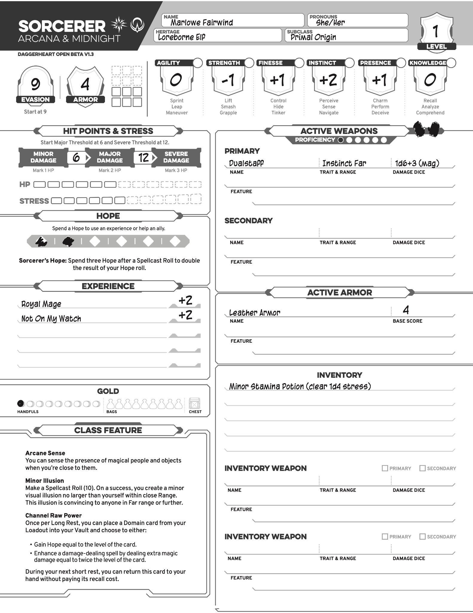
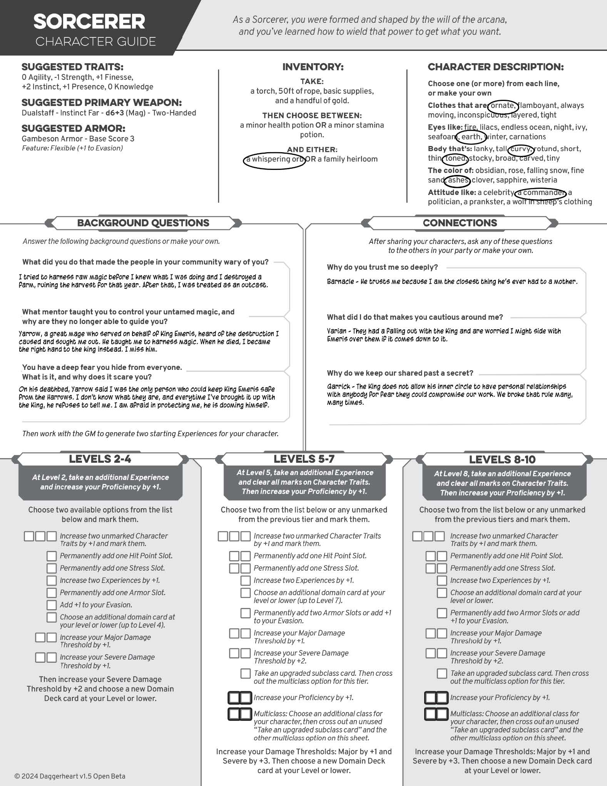

* TOC
{:toc}

### **ГЛАВА ПЕРВАЯ**  
## **Подготовка к приключению**  

В этой главе вы узнаете все необходимое, чтобы подготовиться к своей первой игре в **Daggerheart**. Здесь описан процесс создания персонажа, а также приведены детали [класс](class.md)ов, народностей, сообществ и доменов.  

---

## **Создание персонажа**  

Если вы не играете роль **Ведущего (ГМ)**, то **первое, что вам нужно сделать, — создать своего персонажа**.  
Вы будете **прорабатывать его внешность, личность, прошлый опыт** и **связи с другими персонажами**.  

Некоторые из этих решений **чисто повествовательные** и проявляются только в ролевой игре,  
но есть и **механические выборы**, влияющие на успех ваших действий при бросках костей.  

### **Процесс создания персонажа**  
Эта глава проведет вас по основным шагам создания персонажа.  
Следовать этому порядку **не обязательно**, но **рекомендуется сначала выбрать [класс](class.md)**.  
Остальные элементы можно заполнять в любом порядке.  

---

## **Начало работы**  

### **"Сессия Ноль" (Session Zero)**  
Перед началом новой кампании **проведите "Сессию Ноль"** —  
первая встреча группы, где создаются персонажи и обсуждается мир, в котором пройдет игра.  

На "Сессии Ноль" важно:  
- **Обсудить мир** кампании и его тональность.  
- **Рассказать о своих ожиданиях** и предпочтениях.  
- **Создать персонажей**, которые дополняют друг друга.  
- **Обсудить границы и темы, которых стоит избегать**.  

📌 *Подробности — в разделе "Сессия Ноль и инструменты безопасности" (глава 3).*  

---

## **Разработка концепции персонажа**  

Прежде чем делать окончательный выбор,  
**изучите доступные материалы** и попробуйте сформировать **основную идею персонажа**.  

🧠 *Примеры:*  
- **"Циркач, владеющий магией"**.  
- **"Капитан, потерявший свой корабль в море"**.  

Это **не финальный вариант** — но он **поможет сделать осмысленный выбор** на следующих этапах.  

---

## **Лист персонажа и гайд**  

📜 **Перед началом работы** убедитесь, что у вас есть **лист персонажа и руководство по [класс](class.md)у**.  

💾 Вы можете использовать **бумажную версию** или **цифровую**.  

📌 *Пример готового листа персонажа можно найти в разделе "Пример персонажа".*  

⚠️ **Нет одного стандартного листа персонажа**!  
Каждый лист **уникален для вашего [класс](class.md)а**.  
Загрузите нужные шаблоны **онлайн** или найдите их в этой книге.  

---

## **Запись уровня персонажа**  

🔹 Все персонажи в **Daggerheart** **начинают с 1 уровня**.  
🔹 Запишите **уровень** в верхней части листа персонажа.  
🔹 Повышайте уровень **каждый раз, когда ваш персонаж продвигается**.  

⚠️ *Не рекомендуется начинать игру с более высокого уровня,  
если только ГМ не предложил особые условия.*  

---

## **Заполнение деталей персонажа**  

Вы можете **в любое время** вписать:  
- **Имя** и **местоимения** персонажа.  
- **Описание внешности и особенностей** в листе "Гайд персонажа".  

Для **некоторых игроков** имя и облик персонажа — это **первый шаг**.  
Для **других** — **то, что проясняется по мере выбора других параметров**.  

📌 Главное — **к моменту окончания создания персонажа эти детали должны быть записаны**.

### **Шаг 1: Выберите [[класс](class.md)](class.md)**  

Первый шаг в создании персонажа — **выбрать [класс](class.md)**, а затем взять **лист персонажа** и **гайд** для этого [класс](class.md)а (см. раздел **«Лист персонажа и гайд»**). Они понадобятся вам на протяжении всей игры.  

Каждый [класс](class.md) представляет собой **архетип**, определяющий **уникальные способности**, которые ваш персонаж сможет использовать на протяжении кампании.  

- Например, если вы хотите быть **«танком»**, который бросается в бой и защищает союзников, выберите **Стража (Guardian)**.  
- Если вам интересно использовать **магические заклинания для решения проблем, лечения союзников и борьбы с врагами**, рассмотрите **Мага (Wizard)**.  

После выбора [класс](class.md)а вам нужно **выбрать под[класс](class.md)**. Возьмите соответствующую **карту Основы (Foundation Card)**, так как под[класс](class.md) детализирует стиль вашего персонажа.  

---

## **Уникальная способность [класс](class.md)а**  

Каждый [класс](class.md) обладает **уникальными способностями** (или несколькими),  
которые уже записаны в **нижнем левом углу листа персонажа**.  

⚠️ Если ваша **способность требует выбора** при создании персонажа, обязательно **сделайте его перед началом первой сессии**.  

📌 Подробности о каждой способности можно найти в разделе **«[класс](class.md)ы»**.  

---

## **Список [класс](class.md)ов и их под[класс](class.md)ов**  

В базовый набор входят следующие [класс](class.md)ы и под[класс](class.md)ы.  
Подробнее о них можно узнать в **разделе «[класс](class.md)ы»**.  

### **Бард (Bard)**  
- **Основы:**  
  - **Мастер слова (Wordsmith)** – Оратор, владеющий искусством убеждения.  
  - **Менестрель (Troubadour)** – Музыкант, усиливающий союзников своими мелодиями.  

### **Друид (Druid)**  
- **Основы:**  
  - **Хранитель стихий (Warden of the Elements)** – Олицетворяет природные стихии.  
  - **Хранитель обновления (Warden of Renewal)** – Использует магию природы для исцеления.  

### **Страж (Guardian)**  
- **Основы:**  
  - **Стойкий (Stalwart)** – Выдерживает тяжелые удары и остается на ногах.  
  - **Мститель (Vengeance)** – Наказывает врагов за нападение на союзников.  

### **Следопыт (Ranger)**  
- **Основы:**  
  - **Следопыт (Wayfinder)** – Охотится за добычей с исключительной точностью.  
  - **Звериный союзник (Beastbound)** – Формирует прочную связь с животным-компаньоном.  

### **Серафим (Seraph)**  
- **Основы:**  
  - **Крылатый страж (Winged Sentinel)** – Использует крылья, чтобы наносить мощные удары.  
  - **Божественный воин (Divine Wielder)** – Умело владеет легендарным оружием.  

### **Разбойник (Rogue)**  
- **Основы:**  
  - **Ночной странник (Nightwalker)** – Манипулирует тенями для передвижения.  
  - **Синдикат (Syndicate)** – Везде имеет полезные связи и контакты.  

### **Чародей (Sorcerer)**  
- **Основы:**  
  - **Первородная сила (Primal Origin)** – Увеличивает гибкость заклинаний.  
  - **Элементальная сущность (Elemental Origin)** – Управляет одной из стихий.  

### **Воин (Warrior)**  
- **Основы:**  
  - **Зов убийцы (Call of the Slayer)** – Наносит невероятно мощные удары.  
  - **Зов храбреца (Call of the Brave)** – Использует силу противников против них самих.  

### **Маг (Wizard)**  
- **Основы:**  
  - **Школа знаний (School of Knowledge)** – Глубокое понимание магии и мира.  
  - **Школа войны (School of War)** – Применяет обученную магию для разрушения.  

Выбор [класс](class.md)а и под[класс](class.md)а формирует **стиль игры** вашего персонажа, поэтому **выбирайте тот, который вам по душе!**

### **Шаг 2: Выберите [наследие](ancestry.md)**  

Теперь вам нужно выбрать **[наследие](ancestry.md)** вашего персонажа. Оно состоит из двух частей: **происхождения (Ancestry)** и **сообщества ([Community](community.md))**.  

---

## **Выберите происхождение (Ancestry)**  

Происхождение определяет **родословную** вашего персонажа, влияет на его **внешний вид** и дает **уникальные способности**.  

📌 **Выберите одно из следующих происхождений и запишите его в поле «[наследие](ancestry.md)» на листе персонажа:**  

- **Кланк (Clank)**  
- **Дракона (Drakona)**  
- **Дварф (Dwarf)**  
- **Эльф (Elf)**  
- **Фея (Faerie)**  
- **Фавн (Faun)**  
- **Фирболг (Firbolg)**  
- **Фангрил (Fungril)**  
- **Галапа (Galapa)**  
- **Гигант (Giant)**  
- **Гоблин (Goblin)**  
- **Полурослик (Halfling)**  
- **Человек (Human)**  
- **Инферис (Inferis)**  
- **Катари (Katari)**  
- **Орк (Orc)**  
- **Риббет (Ribbet)**  
- **Симия (Simiah)**  

📖 **Подробнее о происхождениях см. в разделе «Происхождения»**.  

---

## **Выберите сообщество ([Community](community.md))**  

Сообщество определяет **культуру**, в которой вырос ваш персонаж. Это влияет на его **внешний вид, поведение и мировоззрение**.  

📌 **Выберите одно из следующих сообществ и запишите его в поле «[наследие](ancestry.md)» на листе персонажа:**  

- **Высокорожденные (Highborne)**  
- **Знаниеорожденные (Loreborne)**  
- **Орденорожденные (Orderborne)**  
- **Горнорожденные (Ridgeborne)**  
- **Морскорожденные (Seaborne)**  
- **Ловкорожденные (Slyborne)**  
- **Подземнорожденные (Underborne)**  
- **Страннорожденные (Wanderborne)**  
- **Дикорожденные (Wildborne)**  

📖 **Подробнее о сообществах см. в разделе «Сообщества»**.  

---

## **Языки**  

В Daggerheart вам **не нужно выбирать конкретные языки** для персонажа.  

🔹 **Предполагается, что все персонажи говорят на общем языке** (это может быть как естественное, так и магическое понимание).  
🔹 **Жестовый язык** широко распространен и понятен во многих культурах.  
🔹 Если в вашей кампании важны **региональные языки**, обсудите это со своим столом и ГМ.  

📌 **[наследие](ancestry.md) вашего персонажа — важная часть его идентичности, влияющая на стиль игры, поэтому выбирайте осмысленно!**

### **Шаг 3: Назначение характеристик персонажа**  

Теперь вам нужно **назначить значения характеристик** на листе персонажа. Эти показатели отражают **природные** или **тренированные способности** вашего персонажа в **шести основных чертах**:  

- **Ловкость (Agility)** – Бег, Прыжок, Маневр  
- **Сила (Strength)** – Поднять, Разрушить, Захватить  
- **Изящество (Finesse)** – Контроль, Скрытность, Работа с механизмами  
- **Инстинкт (Instinct)** – Чувствовать, Ориентироваться, Воспринимать  
- **Присутствие (Presence)** – Очарование, Выступление, Обман  
- **Знания (Knowledge)** – Анализ, Запоминание, Понимание  

🔹 **Глаголы рядом с чертами – это примеры возможных действий**, которые могут быть связаны с данной характеристикой. Они **не ограничивают** применение черты в игре, а лишь служат вдохновением.  

---

## **Описание черт**  

### **Ловкость (Agility) – Бег, Прыжок, Маневр**  
💠 Высокая Ловкость делает вас **быстрым и проворным**.  
🔹 Примеры действий:  
- Вскарабкаться по веревке  
- Броситься в укрытие  
- Перепрыгнуть с крыши на крышу  

### **Сила (Strength) – Поднять, Разрушить, Захватить**  
💠 Высокая Сила помогает вам **выполнять физически сложные задачи**.  
🔹 Примеры действий:  
- Вышибить дверь  
- Поднять тяжелый объект  
- Удержаться на месте перед атакующим противником  

### **Изящество (Finesse) – Контроль, Скрытность, Работа с механизмами**  
💠 Высокое Изящество делает вас **точным и ловким в мелких движениях**.  
🔹 Примеры действий:  
- Взлом замков  
- Остаться незамеченным  
- Нанести точный удар  

### **Инстинкт (Instinct) – Чувствовать, Ориентироваться, Воспринимать**  
💠 Высокий Инстинкт позволяет вам **различать детали и чувствовать опасность**.  
🔹 Примеры действий:  
- Почувствовать угрозу  
- Заметить что-то важное  
- Выследить врага  

### **Присутствие (Presence) – Очарование, Выступление, Обман**  
💠 Высокое Присутствие делает вас **харизматичным и убедительным**.  
🔹 Примеры действий:  
- Уговорить кого-то помочь вам  
- Запугать противника  
- Привлечь всеобщее внимание  

### **Знания (Knowledge) – Анализ, Запоминание, Понимание**  
💠 Высокие Знания позволяют вам **быстро анализировать и запоминать информацию**.  
🔹 Примеры действий:  
- Распознать магический артефакт  
- Понять замысел врага  
- Вспомнить древнюю легенду  

---

## **Распределение модификаторов черт**  

🎲 **При создании персонажа у вас есть следующие стартовые значения для распределения:**  

📌 **+2, +1, +1, 0, 0, -1**  

### **Как выбрать, куда распределить модификаторы?**  

✅ **Подумайте о своем персонаже:**  
- В чем он силен?  
- Каким оружием он будет пользоваться?  
- Будет ли он использовать магию?  

✅ **Примеры распределения для разных архетипов:**  
🔹 **Воин:** Сила +2, Ловкость +1, Инстинкт +1, Остальные – 0 или -1  
🔹 **Плут:** Ловкость +2, Изящество +1, Присутствие +1, Остальные – 0 или -1  
🔹 **Маг:** Знания +2, Инстинкт +1, Присутствие +1, Остальные – 0 или -1  
🔹 **Следопыт:** Инстинкт +2, Ловкость +1, Изящество +1, Остальные – 0 или -1  

🎭 **Не бойтесь экспериментировать!**  
Если после нескольких сессий вам не нравится ваше распределение, вы можете **изменить** характеристики **с разрешения ГМа**.

### **Шаг 4: Заполнение дополнительных данных персонажа**  

Теперь сделаем небольшую паузу от выбора способностей и **заполним несколько ключевых полей** в листе персонажа.  

---

### **Уклонение (Evasion)**  

**Уклонение (Evasion Score)** отражает, насколько сложно противникам вас поразить.  

📌 **Найдите стартовое значение Уклонения в разделе вашего [класс](class.md)а** (оно указано прямо под полем Evasion на листе персонажа) и **запишите его**.  

📌 Когда противник совершает атаку против вашего персонажа, **ГМ бросает кости против вашего Уклонения**, чтобы определить успех атаки.  

🔹 **Как персонажи уклоняются?**  
- **Волшебник** может избегать ударов, создавая **магические щиты** или отражая заклинания противника.  
- **Следопыт** **ловко уходит с линии атаки**, перемещаясь за укрытия.  
- **Воин** использует **смесь блоков, парирований и перекатов**, чтобы минимизировать урон.  

---

### **Очки здоровья (Hit Points) и Очки стресса (Stress Points)**  

Здоровье и устойчивость персонажа к стрессу отражаются через:  
- **Очки здоровья (HP)** – ваша **физическая стойкость**, способность выдерживать удары и магические атаки.  
- **Очки стресса (Stress Points)** – ваше **психологическое состояние**, способность справляться с давлением и страхом.  

📌 **Запишите значения HP и Stress** на листе персонажа.  

📌 Ваш [класс](class.md) определяет **Порог урона (Damage Threshold)** – **сколько урона персонаж может выдержать перед тем, как терять HP**.  

📌 **Найдите стартовый Порог урона** на листе персонажа в разделе **"Hit Points & Stress"** и **запишите три числа**:  
- **Максимальный HP**  
- **Порог урона** (Damage Threshold)  
- **Максимальный стресс**  

📖 **Подробнее про HP и стресс** можно узнать в главе 2: **"Порог урона и Очки здоровья"**, а также **"Стресс"**.  

---

### **Надежда ([Hope](hope.md)) и Страх ([Fear](fear.md))**  

**🔹 Надежда ([Hope](hope.md))**  
Надежда – это ресурс, отражающий **благоприятный поворот судьбы**.  

📌 **В начале игры персонаж получает 2 [Hope](hope.md)** – **запишите это в соответствующее поле**.  

📌 **Как получать [Hope](hope.md)?**  
- Если при броске **кубик Надежды ([Hope](hope.md) die) выпал выше, чем кубик Страха ([Fear](fear.md) die)**, вы **получаете 1 [Hope](hope.md)**.  
- Максимально можно накопить **до 6 [Hope](hope.md)**.  

📌 **Как использовать [Hope](hope.md)?**  
- **Помочь союзнику** в действии  
- **Применить жизненный опыт** в сложной ситуации  
- **Усилить заклинание или способность**  

**🔹 Страх ([Fear](fear.md))**  
Если **кубик Страха ([Fear](fear.md) die) выпал выше, чем кубик Надежды ([Hope](hope.md) die)**, то персонаж **"бросил с Страхом"**.  

📌 **Что делает [Fear](fear.md)?**  
- **ГМ записывает это в заметки** и может позже потратить накопленный [Fear](fear.md) **на усиление противников или событий в игре**.  
- Иногда бросок с [Fear](fear.md) **создает дополнительную сложность в сцене**, **даже если персонаж успешно справился с задачей**.  

📖 **Больше о механике [Hope](hope.md) и [Fear](fear.md)** можно узнать в главе 2: **"Броски Надежды и Страха"**.

### **Шаг 5: Выбор начального снаряжения**  

Теперь настало время выбрать **оружие, броню и другие предметы**, которые ваш персонаж будет использовать в начале игры.  

---

### **Выбор оружия**  

Персонажи могут использовать **физическое оружие** для атаки врагов. Если у вас есть **признак Заклинателя (Spellcasting Trait)** (например, из под[класс](class.md)а), вы также можете использовать **магическое оружие**.  

📌 **На 1 уровне вы выбираете:**  
- **Основное оружие (Primary Weapon)**  
- **Вторичное оружие (Secondary Weapon)**  

🛑 **Важно:** Если вы выбрали **двуручное оружие**, вы **не сможете одновременно экипировать вторичное оружие**.  

📌 **Как выбрать?**  
- Рекомендации по оружию **указаны в вашем путеводителе персонажа**.  
- Вы также можете выбрать любое стартовое (уровень 1) оружие из таблиц в **главе 2**.  
- Все начальные оружия доступны в разделе **"Таблицы основного и вторичного оружия"** ([раздел в разработке]).  

📌 **Как записать оружие?**  
Запишите **подробности выбранного оружия** в разделе **"Активное оружие"** на листе персонажа.  
- В поле "Proficiency" (Навык урона) запишите **значение 1** (на 1 уровне оно равно 1).  
- В поле "Damage Dice & Type" запишите **уже учтённое количество кубов** (например, **"1d6" вместо "d6"**).  

📖 Подробнее про механику оружия можно найти в **"Использование оружия"** (глава 2).  

---

### **Выбор брони**  

Броня **уменьшает входящий урон** от атак.  

📌 **На 1 уровне вы выбираете:**  
- **Одну броню (Armor)**  
- **Можете сразу экипировать её**  

📌 **Как выбрать?**  
- Рекомендации по броне **указаны в вашем путеводителе персонажа**.  
- Можно выбрать любую броню **уровня 1** из **таблиц брони (глава 2)**.  
- Полный список начальной брони также доступен **онлайн ([раздел в разработке])**.  

📌 **Как записать броню?**  
Запишите детали брони в **раздел "Активная броня"** на листе персонажа.  
- В поле **"Armor Score"** запишите **базовое значение брони + постоянные бонусы от способностей**.  

📌 **Как использовать броню?**  
- Когда вы **получаете урон**, можно **отметить ячейку брони** и **уменьшить урон на значение Armor Score**.  
- Можно отметить **несколько ячеек**, чтобы уменьшить больше урона от одной атаки.  

📖 Подробнее о броне см. в **"Броня" (глава 2)**.  

---

### **Выбор других предметов**  

Ваш инвентарь может содержать **различные полезные вещи**.  

📌 **Начальный набор инвентаря:**  
- **Факел** 🔦 (освещение тёмных мест)  
- **50 футов верёвки** 🪢 (спуск, ловушки)  
- **Базовые припасы** 🎒 (разбить лагерь, готовка)  
- **Небольшое количество золота** 💰 (запишите в поле "Gold")  
- **Зелье на выбор:**  
  - **Малое зелье здоровья** (+1d4 HP)  
  - **Малое зелье выносливости** (очистить 1d4 стресса)  

📌 **Дополнительный предмет**  
- В разделе **"And Either"** (и ещё…) путеводителя персонажа есть **уникальный предмет**, зависящий от [класс](class.md)а.  
- Если у вас есть **заклинания**, вы можете выбрать **объект, через который их кастуете**.  

📌 **Как записать?**  
Все предметы **запишите в раздел "Inventory" (Инвентарь)** на листе персонажа.  

📌 **Можно ли взять что-то ещё?**  
- Вы **можете обсудить с ГМ** добавление других предметов.  
- Обычно разрешены вещи, **не дающие механического преимущества** и **логично вписывающиеся в историю**.  
- В Daggerheart **нет ограничений на размер инвентаря**, но **ГМ принимает финальное решение**.

### **Шаг 6: Создание предыстории персонажа**  

Теперь пришло время **глубже раскрыть вашего персонажа**, заполнив раздел **"Background" (Предыстория)** в путеводителе персонажа.  

---

### **Использование вопросов для вдохновения**  

В этом разделе **предложены несколько вопросов**, которые помогут вам задуматься о прошлом персонажа.  
- Вы **можете изменить** или **дополнить** их вместе с ГМ, если хотите настроить историю под себя.  
- Эти вопросы — **только отправная точка**, **не ограничивайте своё воображение!**  

📌 **Примеры вопросов для предыстории:**  
1. **Откуда ваш персонаж родом?**  
2. **Какое важное событие сформировало его мировоззрение?**  
3. **Какую ошибку из прошлого он надеется исправить?**  
4. **Есть ли у него близкий друг, наставник или враг?**  
5. **Какова его основная мотивация в жизни?**  

---

### **Предыстория влияет на игру**  

📌 **Хотя предыстория — это чисто повествовательный элемент**, она **глубоко влияет на**:  
- **Манеру игры** (как ваш персонаж принимает решения)  
- **Реакцию мира** (ГМ может включить персонажей или события из вашей истории)  
- **Изменение механик** (если при создании истории вы поняли, что нужно поменять способности или атрибуты — это можно сделать!)  

Если вам кажется, что **некоторые механические выборы не соответствуют вашему персонажу**, **измените их**, пока всё не станет на свои места.  

---

### **Как углубить предысторию**  

Если вы хотите **развить историю персонажа**, можно использовать **специальные инструменты**, например:  
- **Карту персонажа** (Character Map)  
- **Сетевые генераторы биографии**  
- **Метод 20 вопросов**  

📌 **Важно!**  
✅ Если у вас **развёрнутая предыстория**, **обязательно поделитесь ею с ГМ**!  
✅ Он сможет **включить ваши идеи в мир игры** и сделать приключение более персонализированным.  
✅ Если же вам **интереснее развивать персонажа в процессе игры**, это **тоже отличный вариант!**  

**Главное правило:** **Играйте так, как вам нравится!**

### **Шаг 7: Выбор Опытов (Experiences)**  

В **Daggerheart** Опыт — это **один из ключевых способов выразить предысторию персонажа и его мастерство через механику**.  

📌 **Опыт (Experience)** — это слово или фраза, отражающая **навыки, которые персонаж приобрёл за свою насыщенную жизнь**.  

---

### **Как выбрать Опыт?**  

🔹 **В начале игры у вас есть два Опыта**, каждый с модификатором **+2**.  
🔹 **Вы не ограничены списком готовых Опытов**, но они должны быть **конкретными и логичными**.  
🔹 Работайте с ГМ, чтобы выбрать Опыт, который **лучше всего отражает личность вашего персонажа**.  

✅ **Правильный выбор Опыта:**  
- **"Ассасин Гильдии Сапфирового Клинка"** (вместо просто "Ассасин")  
- **"Легендарный дуэлянт из Фьорена"** (вместо "Фехтовальщик")  
- **"Шут Королевского двора"** (вместо "Шут")  

⛔ **Неподходящие варианты Опыта:**  
- ❌ **Слишком широкие формулировки** (например, "Талантливый", "Фокусированный")  
- ❌ **Механически ориентированные термины** (например, "Убийство с одного удара", "Полёт")  

---

### **Примеры Опыта**  

📌 **Прошлое персонажа**:  
- Ассасин, Кузнец, Телохранитель, Охотник за головами, Артист цирка, Политик, Пират, Бродяга, Учёный, Солдат, Торговец  

📌 **Черты характера**:  
- Выносливый, Книжный червь, Очаровательный, Лидер, Отшельник, Наблюдательный, Упрямый, Юморист  

📌 **Особые навыки**:  
- Акробат, Азартный игрок, Лекарь, Навигатор, Острый стрелок, Тактик, Шпион  

📌 **Способности**:  
- Приручение зверей, Обман, Починка, Поиск сокровищ, Следопыт, Торговля  

📌 **Фразы**:  
- "Лови меня, если сможешь", "Я не подведу", "Знание — сила", "Путь вперёд", "Мы больше не одни"  

---

### **Использование Опыта**  

📌 Если вы совершаете **бросок действия (Action Roll)**, и ваш Опыт может помочь:  
- **Потратьте 1 Очко Надежды ([Hope](hope.md))**  
- **Добавьте модификатор Опыта (+2) к броску**  

📌 Если подходит **сразу несколько Опытов**:  
- **Можно потратить несколько Очков Надежды**, чтобы добавить к броску несколько модификаторов.  

**Пример:**  
🎭 Ваш персонаж — бывший шпион **"Мастер маскировки"** и **"Броженец теней"**.  
Вы пытаетесь пробраться мимо стражника ночью.  
- Вы **можете потратить 2 [Hope](hope.md)**, чтобы добавить **+4** к броску, если ГМ одобрит применение обоих Опытов.  

---

### **Изменение Опыта**  

📌 Вы получите **новые Опыты** при **повышении уровня**.  
📌 Если один из выбранных Опытов **не соответствует вашему стилю игры**, **вы можете его заменить**.  
📌 Обсудите с ГМ, **какой новый Опыт лучше отразит вашу историю и развитие персонажа**.  

**Главное — играть персонажа, который приносит удовольствие!**

### **Шаг 8: Выбор Карточек Домена (Domain Cards)**  

**Домены** — это **основные элементы [класс](class.md)а** в **Daggerheart**.  

В **Базовом Правиле** есть следующие **Домены**:  
- **Arcana (Аркана)**  
- **Blade (Клинок)**  
- **Bone (Кость)**  
- **Codex (Кодекс)**  
- **Grace (Благодать)**  
- **Midnight (Полночь)**  
- **Sage (Мудрость)**  
- **Splendor (Великолепие)**  
- **Valor (Отвага)**  

Каждый **Домен** имеет **колоду карт** с уникальными **заклинаниями и способностями**.  

---

## **Как выбрать Карты Домена?**  

1️⃣ **Посмотрите, какие Домены принадлежат вашему [класс](class.md)у.**  
   - У каждого [класс](class.md)а **есть два Домена**.  
   - Например:  
     - **Воин (Warrior) → Blade & Bone**  
     - **Друид (Druid) → Sage & Arcana**  
     - **Разбойник (Rogue) → Midnight & Grace**  

2️⃣ **Выберите две карты 1-го уровня** из ваших Доменных колод.  
   - **Вы можете выбрать:**  
     - **Одну карту из каждого Домена** (например, 1 из Arcana и 1 из Sage).  
     - **Две карты из одного Домена** (например, 2 из Blade).  
   - Возвращаем **остальные карты** в колоду.  

3️⃣ **Ваши Карты Домена дают вам особые заклинания и способности.**  
   - **При каждом повышении уровня** вы сможете взять **ещё одну карту**.  

---

### **Общие Домены**  

📌 **Некоторые Домены используются разными [класс](class.md)ами.**  
📌 Например:  
   - **Blade** (Клинок) — у **Стража (Guardian)** и **Воина (Warrior)**  
   - **Sage** (Мудрость) — у **Друида (Druid)** и **Рейнджера (Ranger)**  
   - **Grace** (Благодать) — у **Барда (Bard)** и **Разбойника (Rogue)**  

🎭 **Если у двух игроков есть один и тот же Домен:**  
- **Лучше выбрать разные карты** — так каждый персонаж будет уникальным.  
- **Но можно договориться** и использовать одну и ту же карту, если группа согласна.  

📌 Если у вас **нет двух одинаковых колод**, **можно скачать и распечатать карты** с сайта **Daggerheart**.  

---

### **💡 Советы по выбору Карточек Домена**  

✔ **Выбирайте способности, которые подходят вашему стилю игры**.  
✔ **Комбинируйте два Домена**, чтобы получить интересные сочетания.  
✔ **Обсуждайте выбор с командой**, если Домены пересекаются.  
✔ **Вы сможете менять карты при повышении уровня**, так что не бойтесь экспериментировать!

### **Шаг 9: Создание Связей (Connections)**  

Вы почти завершили создание персонажа! Теперь пора **установить Связи** — **отношения и историю** между вами и другими членами партии.

---

## **Как создать Связи с другими персонажами?**  

1️⃣ **Познакомьте остальных со своим персонажем.**  
   - Минимум, что стоит рассказать:  
     - **Имя**  
     - **Местоимения**  
     - **Описание персонажа**  
     - **Опыт (Experiences)**  
     - **Ответы на вопросы предыстории**  
   - Можно добавить **любые другие детали**, которые захотите.  

2️⃣ **Обсудите, как ваши персонажи связаны друг с другом.**  
   - **Как давно вы знакомы?**  
   - **Какие у вас отношения?**  
   - **Почему вы путешествуете вместе?**  

3️⃣ **Выберите хотя бы один вопрос из раздела Связей на Листе Персонажа.**  
   - Например:  
     - **Кто из вас спас другого в прошлом?**  
     - **С кем у вас неразрешённый конфликт?**  
     - **Кто из вас скрывает что-то от другого?**  
   - Можно **создать свои вопросы** или **изменить** предложенные.  

4️⃣ **Вы имеете право отказаться от связей, которые вам не подходят.**  
   - **Все игроки должны чувствовать себя комфортно** в своих взаимоотношениях.  
   - Если **какая-то связь кажется неуместной**, **обсудите это** и найдите альтернативу.  

5️⃣ **Не все связи должны быть определены сразу.**  
   - Если вы **не уверены в некоторых отношениях**, вы **можете развивать их по ходу игры**.  
   - **Связи** — это **отправная точка** для ролевой игры, а не строгие рамки.  

---

### **💡 Советы по созданию Связей**  

✔ **Выбирайте динамику, которая сделает игру интересной!**  
✔ **Разнообразьте отношения:** дружба, соперничество, доверие, тайны.  
✔ **Создавайте персонажам прошлое, которое влияет на их решения.**  
✔ **Не бойтесь изменять или развивать Связи по мере игры.**  

---

## **Что дальше?**  

🎭 **Связи установлены, персонажи готовы — можно начинать игру!**  
📜 В оставшейся части **Глава 1** содержатся ресурсы для создания персонажей: **информация о Доментах, [класс](class.md)ах, Народах и Сообществах**.  
🎲 **Глава 2** расскажет о **правилах игры и механиках**.  

---

💬 **Дополнительно:**  
🔹 В будущем появятся **рекомендации по созданию персонажей более высокого уровня**!

### **Пример Персонажа (Example Character)**

В этом разделе представлен пример заполненного листа персонажа.  
Вы можете использовать его как образец или вдохновение при создании своего персонажа, изменяя любые детали по своему желанию.  
  
  

## **Домены (Domains) в Daggerheart**  

Домены — это **основные темы**, формирующие каждый [класс](class.md). Комбинация двух доменов определяет **навыки и заклинания**, которые персонаж получает с **картами домена**. При создании персонажа подумайте, какие домены вам интересны — это может повлиять на выбор [класс](class.md)а.  

### **📜 Список Домены**  

### **🔮 Аркана (Arcana)**  
**Магия в чистом виде.** Те, кто идут по этому пути, черпают силу из **хаотичных энергий мира**, манипулируя **стихиями и жизненной энергией**. Аркана предоставляет огромную силу, но требует **умения ее контролировать**.  

➡ **Ключевые аспекты:** стихийная магия, мана, волшебные всплески  

---

### **⚔️ Клинок (Blade)**  
**Искусство владения оружием.** Этот домен — для тех, кто посвятил жизнь **мастерству боя**. Независимо от выбора оружия — меч, лук или экзотические виды вооружения — последователи этого пути обретают **непревзойденный контроль над смертью**.  

➡ **Ключевые аспекты:** смертельная точность, обучение, боевые традиции  

---

### **💀 Кость (Bone)**  
**Тактическое мастерство и скорость.** Те, кто следуют этому пути, обладают **острым пониманием тела и движений**, что делает их **невероятно ловкими бойцами** и позволяет **читать противников** в бою.  

➡ **Ключевые аспекты:** анатомия, акробатика, предугадывание движений  

---

### **📖 Кодекс (Codex)**  
**Глубокое изучение магии.** Этот домен связан с **магическими свитками, книгами, ритуалами и письменами**. Те, кто стремятся к знаниям, обретают **комплексное понимание магии** и способность **использовать ее с расчетом и хитростью**.  

➡ **Ключевые аспекты:** заклинания, ритуалы, тайные знания  

---

### **🎭 Грация (Grace)**  
**Очарование и красноречие.** Независимо от того, использует ли персонаж **убедительные речи, ложь или манипуляции**, этот домен позволяет **изменять восприятие окружающих и управлять их эмоциями**.  

➡ **Ключевые аспекты:** харизма, дипломатия, актерское мастерство  

---

### **🌑 Полночь (Midnight)**  
**Тайны и тени.** Этот домен связан с **обманом, скрытностью и хитростью**. Его последователи могут **исчезать в темноте, проходить незамеченными и раскрывать секреты, недоступные другим**.  

➡ **Ключевые аспекты:** скрытность, разведка, иллюзии  

---

### **🌿 Мудрость (Sage)**  
**Связь с природой.** Этот домен позволяет **черпать силу из самой земли и ее существ**, используя **естественную магию и инстинкты животных**.  

➡ **Ключевые аспекты:** духи природы, первобытная магия, единение с миром  

---

### **✨ Великолепие (Splendor)**  
**Сила жизни.** Этот домен позволяет **исцелять и контролировать процесс жизни и смерти**. Последователи обладают **магией восстановления и способностью даровать (или забирать) жизнь**.  

➡ **Ключевые аспекты:** лечение, восстановление, контроль жизненной силы  

---

### **🛡️ Доблесть (Valor)**  
**Защита и стойкость.** Этот домен связан с **непоколебимой волей и силой**, позволяя **оберегать союзников как в атаке, так и в защите**.  

➡ **Ключевые аспекты:** защита, стойкость, тактика боя  

---

### **🏆 Выбор Домена**  
При создании персонажа каждый [класс](class.md) использует **два домена**, что формирует его уникальный стиль игры. Внимательно выбирайте, какие из доменов **наилучшим образом подходят для вашей концепции персонажа**!

## **Чтение карт доменов (Domain Cards)**  

На **шаге 8** создания персонажа и при **повышении уровня** вы будете получать **карты доменов**, предоставляющие **способности и заклинания** для использования во время приключений.  

Некоторые карты дают **активные действия** (например, **уникальную атаку или заклинание**). Другие обеспечивают **пассивные бонусы**, открывают **новые возможности** во время отдыха или социальных взаимодействий, а некоторые дают **одноразовые эффекты**.  

---

### **🃏 Структура карты домена**  

Каждая карта включает **5 элементов**:  

### **1️⃣ Уровень и домен**  
📌 **Где:** Верхний левый угол  
📌 **Что означает:** Показывает **уровень карты** и **символ домена**.  
📌 **Ограничение:** Можно выбрать **только карты вашего уровня или ниже**.  

---

### **2️⃣ Цена Воспоминания (Recall Cost)**  
📌 **Где:** Верхний правый угол (⚡ символ молнии)  
📌 **Что означает:** Позволяет **перемещать карты между активными и неактивными** в вашем арсенале.  
📌 **Как работает:**  

- До **5 уровня** можно просто **менять карты во время отдыха**.  
- После **5 уровня** у вас будет **больше карт, чем активных слотов**, и чтобы поменять карту на ходу, нужно **потратить Стресс** в размере **цены Воспоминания**.  

🔹 **Пример:** Если карта имеет ⚡ **Recall Cost 2**, вам нужно **пометить 2 Стресса**, чтобы мгновенно активировать ее.  

---

### **3️⃣ Тип карты**  
📌 **Где:** В центре карты, прямо над названием  
📌 **Типы карт:**  
- **Способности (Abilities)** — **не магические** умения  
- **Заклинания (Spells)** — **магические эффекты**  
- **Гримуары (Grimoires)** — уникальные **коллекции заклинаний** (только для домена **Codex**)  

🔹 **Некоторые механики применимы только к определенным типам карт.** Например, способность **увеличивающая урон заклинаний**, **не повлияет на обычные способности**.  

---

### **4️⃣ Эффект карты**  
📌 **Где:** В нижней половине карты  
📌 **Что означает:** Описывает **эффект**, **условия использования**, **специальные правила**  

🔹 **Пример эффекта карты:**  
*"Когда вы атакуете противника в ближнем бою, можете потратить 1 Надежду, чтобы добавить 1d6 к урону."*  

---

### **📖 Дополнительная информация**  
- Подробнее о **работе карт доменов** можно найти в **разделе "Domain Cards" главы 2**.  
- Выбирайте карты **внимательно** — они **определяют уникальный стиль игры** вашего персонажа.  
- Если на карте **есть ограничения или особые условия**, внимательно следуйте их описанию.  

🔥 **Теперь вы готовы выбирать карты доменов и формировать свой стиль игры!**