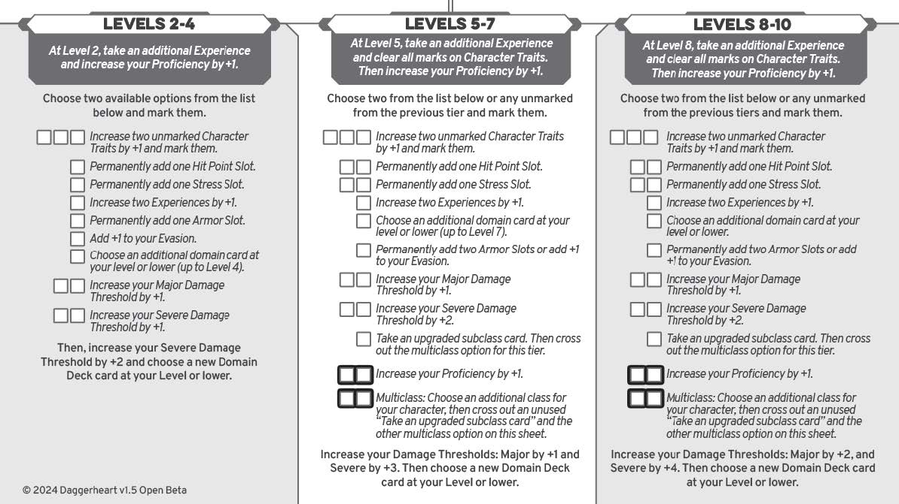
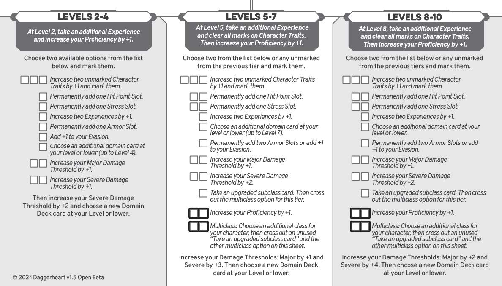
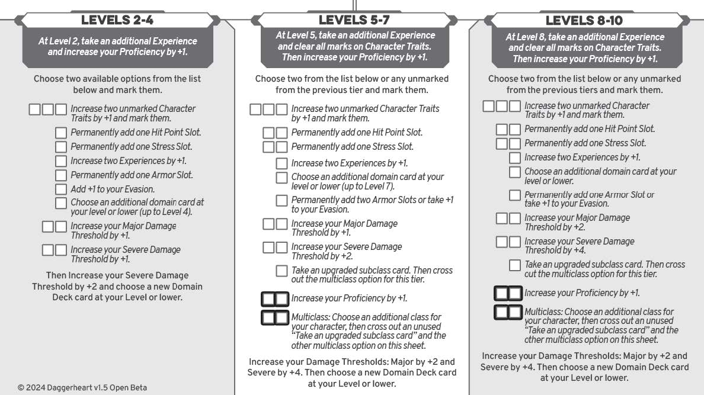
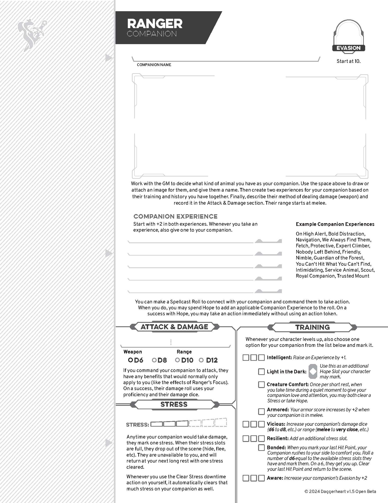
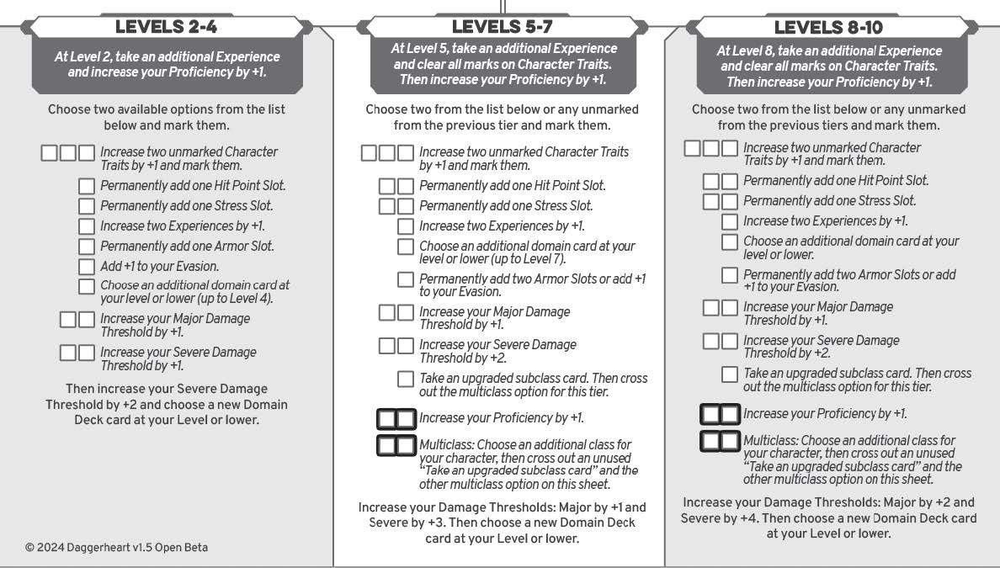
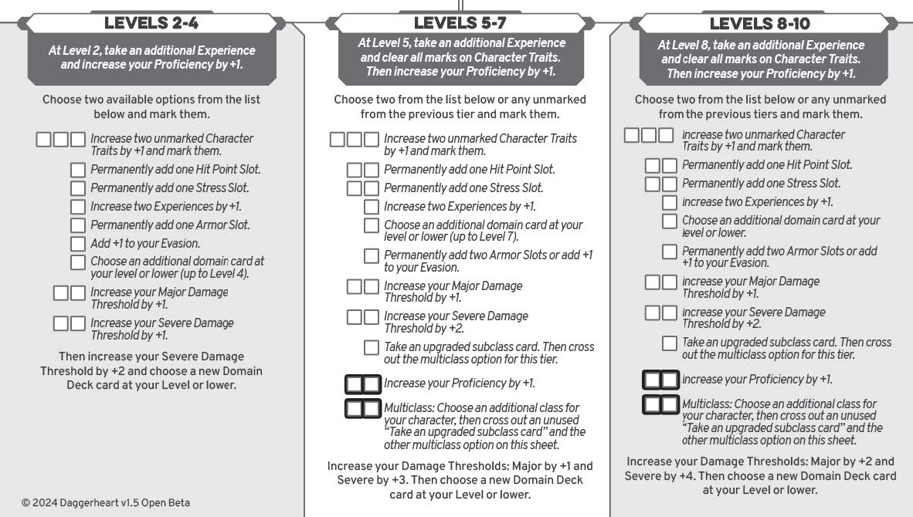
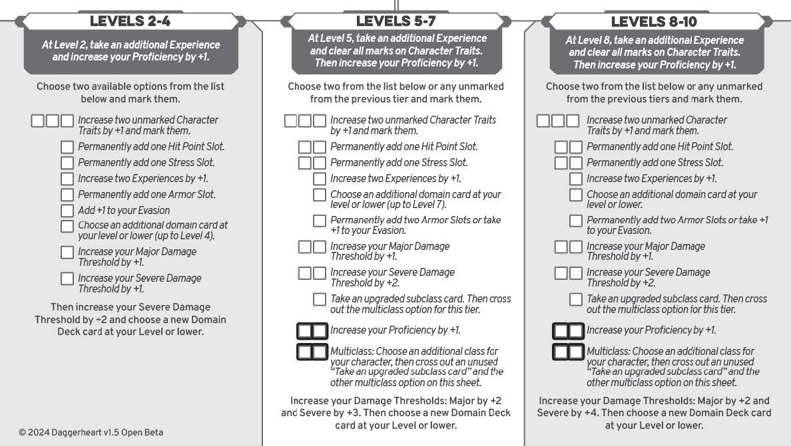
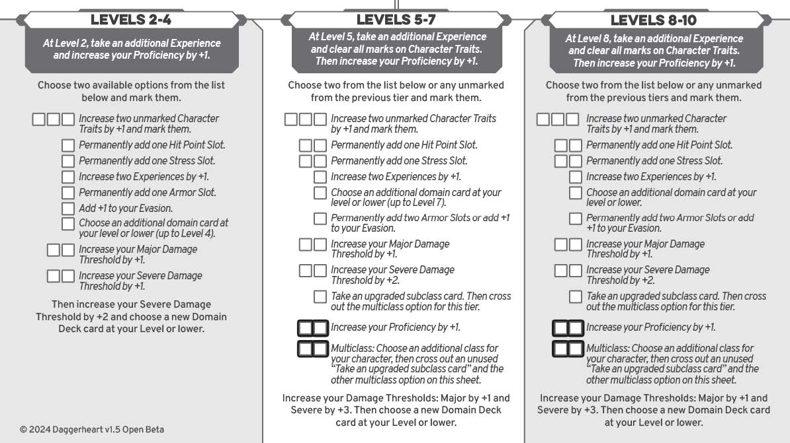
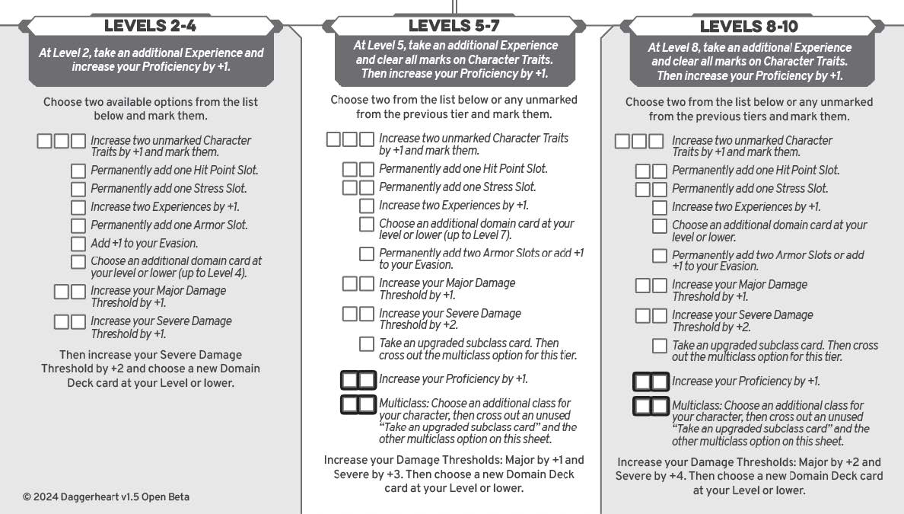
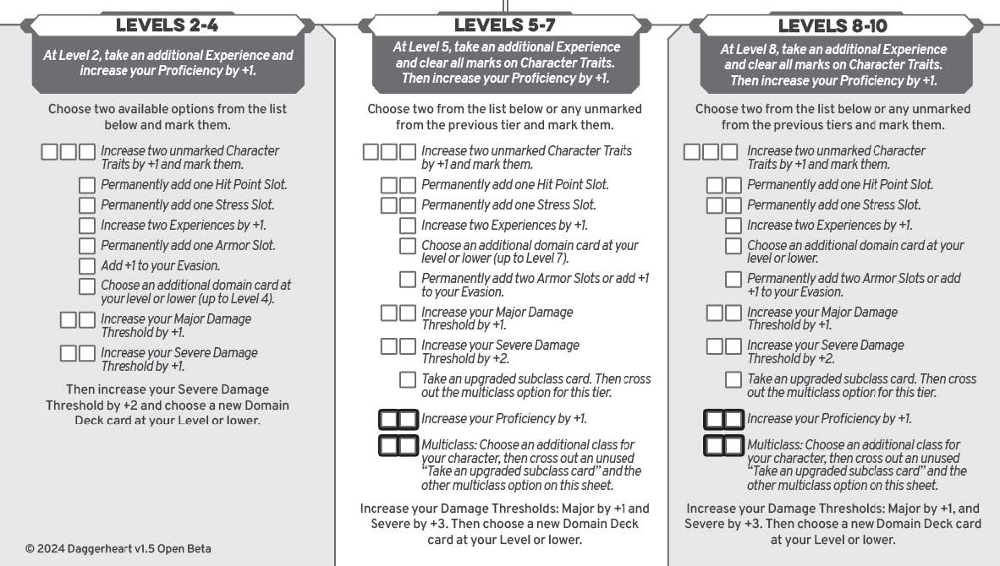

* TOC
{:toc}

## **Класс (Class) в Daggerheart**  

Во время **создания персонажа** вам предстоит выбрать **один из классов** и **его подкласс**.  

Выбранный класс предоставляет **следующие особенности**:  

---

### **🛡️ Основные черты класса**  

**1️⃣ Доменные карты (Domains)**  
- Каждый класс основан на **двух доменах**.  
- Определяют **набор карт** для выбора **при создании персонажа** и **повышении уровня**.  
- **Пример:** У **Рыцаря (Guardian)** — **Blade & Valor**, а у **Мага (Wizard)** — **Codex & Arcana**.  

---

**2️⃣ Базовый показатель уклонения (Starting Evasion Score)**  
- Число, которое **ГМ должен превзойти**, чтобы **попасть по вам атакой**.  
- **Пример:** Если уклонение **10**, противник должен бросить **10+**, чтобы атаковать.  

---

**3️⃣ Порог урона (Damage Threshold)**  
- Определяет, **сколько урона** вы можете выдержать, прежде чем **получить урон по Очкам Жизни (HP)**.  
- У разных классов **разные** пороги урона.  
- **Пример:** У **Воина (Warrior)** **высокий порог урона**, а у **Мага (Wizard)** — **низкий**.  

---

**4️⃣ Классовые предметы (Class Items)**  
- Каждый класс **начинает с уникальным набором предметов**.  
- Включает **оружие, доспехи и дополнительные предметы**.  
- **Пример:** **Разбойник (Rogue)** получает **кинжалы и инструменты вора**, а **Жрец (Seraph)** — **посох и священные реликвии**.  

---

**5️⃣ Уникальная способность класса (Class Feature)**  
- Каждый класс имеет **уникальное умение или набор умений**.  
- Это **ключевая механика**, определяющая **специализацию** персонажа.  
- **Пример:** У **Стража (Guardian)** есть способность **"Взять удар на себя"**, а у **Барда (Bard)** — **"Очаровывающая речь"**.  

---

**6️⃣ Уникальная способность Надежды (Unique Hope Feature)**  
- Каждому классу доступна **особая способность**, которую можно **активировать за 3 Надежды**.  
- **Пример:** **"Надежда Бардов (Bard’s Hope)"** позволяет **воодушевить союзников**, а **"Надежда Воина (Warrior’s Hope)"** — **нанести мощную атаку**.  

---

### **📜 Особенности подкласса (Subclass Features)**  

Выбранный **подкласс** предоставляет **дополнительные** механики:  

**1️⃣ Черта заклинаний (Spellcast Trait)**  
- Если класс **использует магию**, у него будет **основной параметр**, влияющий на заклинания.  
- **Пример:**  
  - Маги используют **Знания (Knowledge)**  
  - Друиды используют **Инстинкт (Instinct)**  
  - Бард использует **Присутствие (Presence)**  

---

**2️⃣ Основная особенность (Foundation Feature)**  
- Это **уникальная способность**, получаемая при выборе подкласса.  
- **Пример:**  
  - **Бард-Трубадур (Troubadour)** получает **"Музыкальное воодушевление"**  
  - **Страж-Возмездие (Vengeance Guardian)** получает **"Карательный удар"**  

---

**3️⃣ Особенность специализации (Specialization Feature)**  
- Открывается **на более высоких уровнях**.  
- Дает **дополнительные механики**.  
- **Пример:** У Разбойника (Syndicate Rogue) появится способность **"Теневой манипулятор"**, усиливающая скрытность.  

---

**4️⃣ Особенность мастерства (Mastery Feature)**  
- Доступна **на поздних уровнях**.  
- Представляет собой **самую мощную способность** подкласса.  
- **Пример:** **"Арканический гений"** у **Мага Школы Знаний (School of Knowledge Wizard)**.  

---

🔥 **Выбор класса и подкласса** — это ключевой этап создания персонажа, определяющий **игровой стиль, механики и возможности** вашего героя в Daggerheart.

## **🎵 Бард (Bard) — Описание Класса**  

**Бард** — это воплощение **харизмы** и **искусства завораживания**. Эти мастера выступлений **покоряют толпы** своими **песнями, музыкой, историями и шутками**. Бард одинаково успешен как в **публичных выступлениях**, так и в **персональном общении**.  

Бардов можно встретить в **гильдиях и школах**, где они **развивают свое мастерство**. Однако **эго** некоторых из них может **разрушить отряд** так же легко, как и **объединить его**.  

---

### **📜 Домены (Domains)**
- **🏹 Благодать (Grace)**
- **📖 Кодекс (Codex)**  

---

### **🛡️ Начальное Уклонение (Starting Evasion Score)**  
**9**  

---

### **💔 Пороги Урона (Damage Thresholds)**  
- **Минорный урон**: 6  
- **Серьёзный урон**: 12  

---

### **🎒 Начальное Снаряжение (Class Items)**  
- **Романтический роман** *или* **неоткрытое письмо**  

---

### **✨ Надежда Барда (Bard’s Hope)**
Когда вы **или союзник в ближнем радиусе** совершаете **бросок Присутствия (Presence)** и **терпите неудачу или успешны, но с последствием (Fear)**, вы можете **потратить 3 Надежды**, чтобы **отменить последствия этого броска**, вмешавшись.  

---

## **🎤 Классовая Особенность (Class Feature)**
### **📢 Подъём духа (Rally)**
**Раз за сессию**, когда ваша группа готовится **к опасному испытанию**, **опишите**, как вы **воодушевляете союзников**. После этого вы и **каждый ваш союзник** получают **1d6 Кубик Подъёма (Rally die)**.  

Любой, у кого есть **Rally die**, может **использовать его**, чтобы:  
- **Добавить результат к броску** **действия, реакции или урона**.  
- **Снять количество Стресса**, равное выпавшему значению.  

**Неиспользованные Rally dice очищаются в конце сессии.**  
На **5 уровне** Кубик Подъёма увеличивается до **1d8**.  

---

## **🎭 Подклассы Барда (Bard Subclasses)**  
### **📚 📜 Красноречивец (Wordsmith)**  
**Выберите этот подкласс**, если хотите **убеждать, манипулировать и добиваться своего с помощью слов**.  

🔮 **Черта заклинаний:** Присутствие (Presence)  

---

#### **🏆 Основные особенности (Foundation Features)**  
**📖 Сердце поэта (Heart of a Poet)**  
Когда вы говорите с **человеком, которого пытаетесь впечатлить, убедить или оскорбить**, вы можете **потратить 1 Надежду**, чтобы добавить **1d4** к своему броску против него.  

**🗣 Воодушевляющая речь (Rousing Speech)**  
**Раз за долгий отдых**, вы можете **использовать действие**, чтобы произнести **эмоциональную, вдохновляющую речь**.  
- **Все союзники**, которые могут вас слышать, **снимают 2 Стресса**.  

---

#### **🌟 Особенность Специализации (Specialization Feature)**  
Вы знаете, что **слова** могут **укрепить дух группы**. **Раз за сессию**, когда вы **поощряете или вдохновляете союзника**, вы можете:  
- **Позволить ему найти нужный предмет или инструмент.**  
- **Помочь союзнику без траты Надежды.**  
- **Дать ему дополнительное Действие Отдыха.**  

---

#### **🌟 Особенность Мастерства (Mastery Feature)**  
- **Ваш Кубик Подъёма (Rally die) увеличивается до 1d10.**  
- **Когда вы помогаете союзнику (Help an Ally), если описываете момент так, словно пишете мемуары о его героизме, ваш кубик преимущества становится d10 вместо d6.**  

---

### **🎻 🎼 Трубадур (Troubadour)**  
Выберите этот подкласс, если **хотите играть музыку, вдохновлять союзников и ослаблять врагов**.  

🔮 **Черта заклинаний:** Присутствие (Presence)  

---

#### **🏆 Основная особенность (Foundation Feature)**  
Когда вы **создаёте персонажа**, **опишите инструмент**, на котором вы **мастерски играете**.  

Вы можете **использовать действие**, чтобы исполнить **каждую из этих песен раз за долгий отдых**:  
🎵 **Успокаивающая песня** — Вы и **все союзники в ближнем радиусе** **лечите 1 ОЗ (HP)**.  
🔥 **Эпическая песня** — **Выбранная цель в ближнем радиусе становится Уязвимой (Vulnerable)**.  
💔 **Разрывающая сердце песня** — Вы и **все союзники в ближнем радиусе** **получаете 1 Надежду**.  

---

#### **🌟 Особенность Специализации (Specialization Feature)**  
Ваши **воодушевляющие песни** **укрепляют дух**.  
- **Любой союзник, получающий от вас Кубик Подъёма (Rally die), также может получить 1 Надежду или снять 1 Стресс.**  

---

#### **🌟 Особенность Мастерства (Mastery Feature)**  
- **Вы можете исполнять каждую из своих песен на 1 раз больше за долгий отдых.**  

---

## **🎭 Вопросы о прошлом (Background Questions)**  
Используйте эти вопросы, чтобы раскрыть историю вашего персонажа:  
- **Кто из вашего сообщества научил вас быть уверенным в себе?**  
- **Вы когда-то были влюблены. Кто это был и как он вас ранил?**  
- **Вы всегда восхищались другим бардом. Кто это и почему он ваш кумир?**  

---

## **🤝 Связи (Connections)**  
Определите отношения с другими персонажами в группе:  
- **Что заставило вас понять, что мы станем хорошими друзьями?**  
- **Что в моих поступках вас раздражает?**  
- **Почему вы берёте меня за руку по ночам?**  

---

### **🎶 Итог: Почему стоит выбрать Барда?**
**+** Великолепная **харизма** и **социальное влияние**.  
**+** Способность **вдохновлять и исцелять союзников**.  
**+** Гибкость: может быть **оратором (Wordsmith) или музыкантом (Troubadour)**.  
**+** Отлично подходит для **творческих игроков**.  

Бард **не только развлекает, но и ведёт за собой** — будь то **речь, песня или просто мастерски подобранные слова**.

## **🌿 Друид (Druid) — Описание Класса**  

Стать **друидом** — это **не просто профессия, а призвание**. Друиды ощущают **связь с природой** и стремятся **защитить её магию**.  

- **Некоторые** используют **тихие, незаметные** заклинания, влияя на рост растений.  
- **Другие** способны **воплощать в себе мощь диких зверей**, становясь **ужасающими в бою**.  

Друиды **обучаются в небольших сообществах**, объединённых **общими взглядами** и **связью с природой**.  
Они могут **изменять форму**, становясь **зверями** или даже **воплощением стихий**.  

---

### **📜 Домены (Domains)**
- **🐾 Мудрость (Sage)**
- **🔮 Аркана (Arcana)**  

---

### **🛡️ Начальное Уклонение (Starting Evasion Score)**  
**8**  

---

### **💔 Пороги Урона (Damage Thresholds)**  
- **Минорный урон**: 7  
- **Серьёзный урон**: 14  

---

### **🎒 Начальное Снаряжение (Class Items)**  
- **Маленький мешочек с камнями и костями** *или* **Странный кулон, найденный в земле**  

---

### **✨ Надежда Друида (Druid’s Hope)**
**Потратьте 3 Надежды**, чтобы, находясь в **Звероформе (Beastform)**, **увеличить ваши пороги урона на +3** до тех пор, пока форма не спадёт.  

---

## **🌱 Классовые Особенности (Class Features)**  
### **🍃 Дикие прикосновения (Wildtouch)**
Вы можете **создавать небольшие природные эффекты** **по желанию**:  
- **Быстро вырастить цветок** 🌸  
- **Создать лёгкий порыв ветра** 🍃  
- **Зажечь костёр** 🔥  

---

### **🐾 Звероформа (Beastform)**
Вы можете **потратить 1 Стресс**, чтобы превратиться в **магическое существо** вашего уровня или ниже **из списка Звероформ**.  

🔹 В **Звероформе** вы **не можете использовать оружие или заклинания**, но **получаете**:  
- **Особенности зверя**  
- **Тип атаки зверя**  
- **Бонус к уклонению зверя**  

**🛡 Броня** становится **частью вашего тела**, и **использованные слоты брони остаются отмеченными** даже после выхода из формы.  

**❗ Если у вас заканчиваются Очки Жизни (HP) или Стресс, форма автоматически спадает.**  

---

## **🌿 Подклассы Друида (Druid Subclasses)**  
### **🌊 Хранитель Стихий (Warden of the Elements)**  
Выберите этот подкласс, если хотите **воплощать силы природы**.  

🔮 **Черта заклинаний:** Инстинкт (Instinct)  

---

#### **🏆 Основная особенность (Foundation Feature)**  
### **🔥 Воплощение Стихии (Elemental Incarnation)**
**Потратьте 1 Стресс**, чтобы **воплотить силу одной из стихий**.  
Эффект длится **до получения Серьёзного урона (Severe) или до короткого отдыха**.  

🔹 Эта особенность **может сочетаться с Звероформой**.  

Выберите одну из стихий:  

🔥 **Огонь** — Если враг в **ближнем бою** наносит вам урон, он получает **1d10 магического урона**.  
🪨 **Земля** — Ваш **базовый показатель брони увеличивается на +1**.  
💧 **Вода** — Когда вы наносите урон **врагу в ближнем бою**, **все враги в Очень Близком радиусе (Very Close) получают 1 Стресс**.  
🌪 **Воздух** — Вы можете **парить**, получая **преимущество на броски Ловкости (Agility)**.  

---

#### **🌟 Особенность Специализации (Specialization Feature)**  
**Раз за короткий отдых**, пока действует **Воплощение Стихии**, вы можете создать **ауру** соответствующего элемента, влияющую на область **в пределах Близкого радиуса**:  

🔥 **Огонь** — Враги, теряющие **1+ ОЗ**, получают **1 Стресс**.  
🪨 **Земля** — **Союзники** получают **+1 к Броне**.  
💧 **Вода** — После получения урона **вы можете потратить 1 Стресс**, чтобы **переместить врага в пределах Очень Близкого радиуса**.  
🌪 **Воздух** — Если **вы или союзник** получаете **урон от атаки дальнего боя**, **уменьшите его на 1d8**.  

---

#### **🌟 Особенность Мастерства (Mastery Feature)**  
Вы **ещё больше сливаетесь со стихией**, получая **дополнительный эффект**:  

🔥 **Огонь** — **Ваш бонус к Владению (Proficiency) увеличивается на +1** для атак и заклинаний, наносящих урон.  
🪨 **Земля** — Когда вы **используете слот брони**, **бросьте 1d6**. На **5 или 6** — **очистите слот брони**.  
💧 **Вода** — Когда **вас атакуют**, **потратьте 1 Стресс**, чтобы **сделать атакующего Уязвимым (Vulnerable)**.  
🌪 **Воздух** — **+1 к Уклонению** и **вы получаете возможность летать**.  

---

### **🌿 Хранитель Возрождения (Warden of Renewal)**  
Выберите этот подкласс, если хотите **использовать мощную магию для исцеления союзников**.  

🔮 **Черта заклинаний:** Инстинкт (Instinct)  

---

#### **🏆 Основная особенность (Foundation Features)**  
### **🌾 Ясность Природы (Clarity of Nature)**
**Раз за долгий отдых**, создайте **зону природной гармонии**.  
- После **нескольких минут отдыха в этом месте**, **снимите количество Стресса, равное вашему Инстинкту**, распределяя между собой и союзниками.  

### **🌿 Регенерация (Regeneration)**
**Используйте действие и потратьте 3 Надежды**, чтобы **восстановить 1d4 ОЗ существу, которого касаетесь**.  

---

#### **🌟 Особенность Специализации (Specialization Feature)**  
- **Теперь вы можете использовать "Регенерацию" на цель в Очень Близком радиусе (Very Close), а не только касаясь её.**  
- **Раз за долгий отдых** вы можете **починить броню** вне отдыха.  
- Вы или союзник в **Близком радиусе** могут **восстановить количество Слотов Брони**, равное вашему Инстинкту.  

---

#### **🌟 Особенность Мастерства (Mastery Feature)**  
**Ваша Звероформа теперь воплощает дух целителя.**  
- Когда **союзник в Близком радиусе получает 2+ ОЗ урона**, **вы можете потратить 1 Стресс**, чтобы **уменьшить этот урон на 1 ОЗ**.  

---

## **🌱 Вопросы о прошлом (Background Questions)**  
- **Почему ваше сообщество так зависело от природы и её существ?**  
- **Какая была ваша первая связь с диким животным? Почему она прервалась?**  
- **Кто охотится за вами? Что, по-вашему, им нужно?**  

---

## **🤝 Связи (Connections)**  
- **Что вы мне признались, из-за чего я всегда бросаюсь вас защищать?**  
- **Каким животным я вас называю?**  
- **Какое ласковое прозвище вы мне дали?**  

---

## **🌿 Итог: Почему стоит выбрать Друида?**  
✔ **Связь с природой** и **уникальные способности**.  
✔ **Гибкость**: можно **менять формы, исцелять, атаковать или защищаться**.  
✔ **Множество вариаций игры** через **зверей, магию и элементы**.  
✔ **Отличный выбор** для тех, кто **любит природу и трансформации**!

## **🐾 Использование Звероформы (Beastform)**  

Когда вы используете **Звероформу**, выберите **категорию существ** соответствующего **вашего уровня или ниже**.  

**📝 Особенности трансформации:**  
✔️ Вы **можете выбрать любое животное**, **подходящее под категорию**, с одобрения **ГМа**.  
✔️ **Вы не можете использовать экипировку и заклинания**, но **сохраняете доступ** к **другим способностям**, таким как **Дикие прикосновения (Wildtouch)**.  
✔️ **Вы получаете бонусы** от новой формы, **пока она активна**.  
✔️ Когда форма **пропадает**, **все бонусы исчезают**.  

---

## **📜 Категории Звероформ (Beastform List)**  

Каждая форма включает **следующие параметры** (на примере **Проворного Разведчика (Agile Scout)**):

| **📌 Параметр**          | **📖 Описание** |
|--------------------------|----------------|
| **Категория Существа**  | Определяет **общую роль или поведение** (например, "Проворный Разведчик"). В скобках указаны **примеры животных** этой категории (например, **лиса, мышь, ласка**). |
| **Черта персонажа**      | **Пока активна форма**, добавьте **указанный бонус** к **соответствующей характеристике**. (Например, "Agility +1"). |
| **Атаки**               | **Как атаковать в звероформе**: указаны **дальность, характеристика атаки и урон**. (Например, **атака в ближнем бою (Melee) через Ловкость (Agility), наносит 1d4 физического урона**). |
| **Уклонение (Evasion)** | **Добавляет бонус к вашему Уклонению** на время трансформации. (Например, если ваше обычное уклонение **8**, а форма даёт **Evasion +2**, то **новое уклонение = 10**). |
| **Преимущества (Advantage)** | Вы получаете **преимущество** на определённые действия. Например, **разведчик получает бонус на скрытность, поиск объектов, уклонение от опасностей**. |
| **Особенности (Features)** | Каждая форма **даёт уникальные способности**. Например, **разведчик может двигаться бесшумно, но более уязвим**. |

---

## **📌 Пример — Проворный Разведчик (Agile Scout)**  
**Примеры животных:** 🦊 **Лиса, мышь, ласка**  

- **📊 Черта:** +1 Ловкость (Agility)  
- **⚔️ Атака:** Ближний бой (Melee), **Ловкость (Agility), 1d4 физический урон**  
- **🛡️ Уклонение:** +2  
- **🎲 Преимущества:** На скрытность, поиск, уклонение от ловушек  
- **💡 Особенности:**  
  - **Бесшумное передвижение**  
  - **Повышенная хрупкость — форма спадает быстрее при получении урона**  

---

## **❗ Важные Моменты**  
- **🦴 Урон**: Если вы **теряете все ОЗ или Стресс**, форма **автоматически спадает**.  
- **🐺 Гибкость**: Вы **можете выбирать** любые звериные формы **в пределах вашего уровня**.  
- **✨ Комбинирование**: Можно **использовать другие способности класса** во время трансформации!  

Звероформа **даёт огромные тактические возможности**, позволяя **адаптироваться** к любой ситуации! 🐾

## **🐾 Звероформы — 1 Уровень (Tier 1 Beastforms)**  

Выберите одну из этих форм при использовании **Звероформы (Beastform)**.  

---

### **🦊 Проворный Разведчик (Agile Scout)**  
(**Лиса, мышь, ласка и др.**)  

- **📊 Черта:** +1 Ловкость (Agility)  
- **⚔️ Атака:** **Укус** (Ближний бой, Ловкость, 1d4 физический урон)  
- **🛡️ Уклонение:** +2  
- **🎲 Преимущества:** Обман (Deceive), Поиск (Locate), Скрытность (Sneak)  
- **💡 Особенности:**  
  - **🏃‍♂️ Проворство (Agile):** Ваше передвижение бесшумно. Вы можете потратить **1 Надежду (Hope)**, чтобы мгновенно переместиться в любую точку **Дальнего (Far) радиуса** **без броска**.  
  - **💔 Хрупкость (Fragile):** Если получаете **Серьёзный (Major) урон или выше**, форма **пропадает**.  

---

### **🐶 Домашний Друг (Household Friend)**  
(**Собака, кошка, кролик и др.**)  

- **📊 Черта:** +1 Инстинкт (Instinct)  
- **⚔️ Атака:** **Укус** (Ближний бой, Инстинкт, 1d6 физический урон)  
- **🛡️ Уклонение:** +2  
- **🎲 Преимущества:** Лазание (Climb), Поиск (Locate), Защита (Protect)  
- **💡 Особенности:**  
  - **👬 Компаньон (Companion):** Когда вы **помогаете** другому персонажу, используйте **d8** вместо d6 для броска преимущества.  
  - **💔 Хрупкость (Fragile):** Если получаете **Серьёзный (Major) урон или выше**, форма **пропадает**.  

---

### **🦌 Гибкий Травоядный (Nimble Grazer)**  
(**Олень, коза, газель и др.**)  

- **📊 Черта:** +1 Ловкость (Agility)  
- **⚔️ Атака:** **Удар копытами** (Ближний бой, Ловкость, 1d6 физический урон)  
- **🛡️ Уклонение:** +3  
- **🎲 Преимущества:** Прыжок (Leap), Скрытность (Sneak), Разведка (Scout)  
- **💡 Особенности:**  
  - **🏹 Ускользающая добыча (Elusive Prey):** Если вас атакуют, вы можете **отметить Стресс (Stress)** и бросить **1d4**, добавляя результат к вашему **Уклонению** для этой атаки.  
  - **💔 Хрупкость (Fragile):** Если получаете **Серьёзный (Major) урон или выше**, форма **пропадает**.  

---

### **🐺 Хищник Стаи (Pack Predator)**  
(**Волк, койот, гиена и др.**)  

- **📊 Черта:** +2 Сила (Strength)  
- **⚔️ Атака:** **Укус** (Ближний бой, Сила, 1d8+2 физический урон)  
- **🛡️ Уклонение:** +1  
- **🎲 Преимущества:** Атака (Attack), Бег (Sprint), Отслеживание (Track)  
- **💡 Особенности:**  
  - **🐕 Охота в стае (Pack Hunting):** Если ваш союзник **атаковал ту же цель прямо перед вами**, добавьте **ещё 1d8** к урону.  
  - **🦴 Ковыляющий удар (Hobbling Strike):** При успешной **ближней атаке**, **отметьте Стресс (Stress)**, чтобы сделать цель **Уязвимой (Vulnerable)**.  

---

### **🐠 Водный Разведчик (Aquatic Scout)**  
(**Рыба, угорь, осьминог и др.**)  

- **📊 Черта:** +1 Ловкость (Agility)  
- **⚔️ Атака:** **Укус** (Ближний бой, Ловкость, 1d4 физический урон)  
- **🛡️ Уклонение:** +2  
- **🎲 Преимущества:** Навигация (Navigate), Скрытность (Sneak), Плавание (Swim)  
- **💡 Особенности:**  
  - **🌊 Водное создание (Aquatic):** Вы можете **дышать и двигаться в воде естественно**.  
  - **💔 Хрупкость (Fragile):** Если получаете **Серьёзный (Major) урон или выше**, форма **пропадает**.  

---

### **🕷️ Преследующий Паукообразный (Stalking Arachnid)**  
(**Тарантул, паук-волк и др.**)  

- **📊 Черта:** +1 Ловкость (Finesse)  
- **⚔️ Атака:** **Укус** (Ближний бой, Ловкость, 1d6+1 физический урон)  
- **🛡️ Уклонение:** +2  
- **🎲 Преимущества:** Атака (Attack), Лазание (Climb), Скрытность (Sneak)  
- **💡 Особенности:**  
  - **🕸️ Плетение паутины (Webslinger):** Вы можете создавать **крепкую паутину** для **путешествий или боя**. Можно **захватить (Restrained)** цель в **Ближнем радиусе (Close)**, сделав **бросок Ловкости (Finesse)**.  
  - **☠️ Ядовитый укус (Venomous Bite):** Если вы **успешно атакуете** в ближнем бою, цель становится **Отравленной (Envenomated)**.  
    - **Отравленный враг получает 1d10 урона при каждом действии.**  
    - **Этот эффект не суммируется.**  

---

### **📝 Итог:**  
Каждая **Звероформа** даёт **уникальные боевые и исследовательские способности**. Выбирайте **исходя из ситуации** и **вашей стратегии в игре**! 🦊🐺🐠

## **🐾 Звероформы — 2 Уровень (Tier 2 Beastforms)**  

Выберите одну из этих форм при использовании **Звероформы (Beastform)**.  

---

### **🛡️ Бронированный Страж (Armored Sentinel)**  
(**Броненосец, панголин, черепаха и др.**)  

- **📊 Черта:** +1 Сила (Strength)  
- **⚔️ Атака:** **Удар панцирем** (Ближний бой, Сила, 1d8+2 физический урон)  
- **🛡️ Уклонение:** +1  
- **🎲 Преимущества:** Копание (Dig), Защита (Protect), Поиск (Locate)  
- **💡 Особенности:**  
  - **🛡️ Панцирная броня (Armored Shell):** У вас **сопротивление физическому урону**. Вы можете **отметить бронеслот**, чтобы свернуться в защитную позу.  
    - В этом состоянии **физический урон дополнительно уменьшается на ваш броневой счёт** (после уменьшения вдвое).  
    - **Вы не можете выполнять другие действия, кроме передвижения**, пока не выйдете из этой позы.  
  - **🎯 Пушечное ядро (Cannon Ball):**  
    - **Отметьте Стресс (Stress)**, чтобы вас могли **подбросить или метнуть в противника**.  
    - **Союзник** выполняет **бросок атаки (Agility или Strength)** по цели в **Ближнем радиусе (Close)**.  
    - **При успехе:**  
      - **Наносится 1d12+2 урона**, используя **профициент метателя**.  
      - Если рядом с целью есть ещё один враг, можно **потратить Надежду (Hope)**, чтобы **рикошетить** и нанести второму врагу **половину урона**.  

---

### **🐻 Брутальный Зверь (Brutish Beast)**  
(**Медведь, бык, лось и др.**)  

- **📊 Черта:** +1 Сила (Strength)  
- **⚔️ Атака:** **Разрывающий удар** (Ближний бой, Сила, 1d10+4 физический урон)  
- **🛡️ Уклонение:** +3  
- **🎲 Преимущества:** Навигация (Navigate), Запугивание (Scare), Защита (Protect)  
- **💡 Особенности:**  
  - **💢 Ярость (Rampage):**  
    - **При броске урона**, если выпал **1**, вы можете **перебросить d10** и добавить его к урону.  
    - **Перед броском атаки**, можно **отметить Стресс (Stress)**, чтобы **получить +1 к Профиценту (Proficiency)**.  
  - **🛡️ Толстая шкура (Thick Hide):** В этой форме **ваши пороги урона увеличиваются на +2**.  

---

### **🐎 Могучий Скакун (Mighty Strider)**  
(**Верблюд, лошадь, зебра и др.**)  

- **📊 Черта:** +1 Ловкость (Agility)  
- **⚔️ Атака:** **Удар копытами** (Ближний бой, Ловкость, 1d8+1 физический урон)  
- **🛡️ Уклонение:** +2  
- **🎲 Преимущества:** Прыжок (Leap), Навигация (Navigate), Бег (Sprint)  
- **💡 Особенности:**  
  - **🚶 Носитель (Carrier):** Вы можете **переносить до 2 союзников**, когда передвигаетесь.  
  - **🏇 Топот (Trample):**  
    - **Отметьте Стресс (Stress)**, чтобы **двигаться прямо до Ближнего радиуса (Close)**.  
    - **Атакуйте всех врагов, через которых проходите** (наносите 1d8+1 физического урона).  
    - **Попавшие под атаку враги сбиваются с ног и становятся временно Уязвимыми (Vulnerable)**.  

---

### **🐍 Ударная Змея (Striking Serpent)**  
(**Гадюка, кобра и др.**)  

- **📊 Черта:** +1 Ловкость (Finesse)  
- **⚔️ Атака:** **Ядовитый укус** (Очень Близкий бой, Ловкость, 1d8+4 физический урон)  
- **🛡️ Уклонение:** +2  
- **🎲 Преимущества:** Атака (Attack), Лазание (Climb), Обман (Deceive)  
- **💡 Особенности:**  
  - **☠️ Ядовитый удар (Venomous Strike):**  
    - **Атакуйте всех врагов в Очень Близком радиусе (Very Close)**.  
    - **При успехе:** цель становится **Отравленной (Envenomated)**.  
    - **Отравленный враг получает 1d10 урона при каждом своём действии** (эффект не суммируется).  

---

### **🦁 Хищник-Охотник (Pouncing Predator)**  
(**Гепард, лев, пантера и др.**)  

- **📊 Черта:** +1 Инстинкт (Instinct)  
- **⚔️ Атака:** **Мощный укус** (Ближний бой, Инстинкт, 1d8+6 физический урон)  
- **🛡️ Уклонение:** +3  
- **🎲 Преимущества:** Атака (Attack), Лазание (Climb), Скрытность (Sneak)  
- **💡 Особенности:**  
  - **💨 Беглец (Fleet):** **Потратьте Надежду (Hope)**, чтобы мгновенно переместиться **в любую точку в Дальнем радиусе (Far) без проверки**.  
  - **🐾 Захват (Takedown):**  
    - **Отметьте Стресс (Stress)**, чтобы мгновенно переместиться в **ближний бой** и совершить **атаку**.  
    - **При успехе:**  
      - **Добавьте +2 Профицент к урону**.  
      - **Цель получает 1 Стресс (Stress)**.  

---

### **🦅 Крылатый Зверь (Winged Beast)**  
(**Ворон, ястреб, сова и др.**)  

- **📊 Черта:** +1 Ловкость (Finesse)  
- **⚔️ Атака:** **Клювом и когтями** (Ближний бой, Ловкость, 1d4+2 физический урон)  
- **🛡️ Уклонение:** +3  
- **🎲 Преимущества:** Обман (Deceive), Поиск (Locate), Запугивание (Scare)  
- **💡 Особенности:**  
  - **🕊️ Птичий глаз (Bird's Eye View):**  
    - Вы можете **летать по желанию**.  
    - **Сделайте бросок**, чтобы осмотреть местность с высоты. **При успехе** получаете **ценную информацию**.  
    - Вы и ваши союзники **получаете преимущество при действиях на основе этой информации**.  
  - **⚠️ Полые кости (Hollow Bones):** В этой форме **ваши пороги урона уменьшаются на -2**.  

---

### **📝 Итог:**  
Звероформы **2 уровня** — мощные и специализированные, каждая со **сильными боевыми и защитными способностями**. Выбирайте **по стилю игры и нуждам команды**! 🦁🐍🦅

## **🐾 Звероформы — 3 Уровень (Tier 3 Beastforms)**  

На **3 уровне** звероформы становятся **чудовищно сильными**, предоставляя **уникальные боевые и защитные способности**.  

---

### **🦖 Великий Хищник (Great Predator)**  
(**Лютый волк, саблезубый тигр, раптор и др.**)  

- **📊 Черта:** +2 Сила (Strength)  
- **⚔️ Атака:** **Разрывающая пасть** (Ближний бой, Сила, 1d12+8 физический урон)  
- **🛡️ Уклонение:** +2  
- **🎲 Преимущества:** Атака (Attack), Скрытность (Sneak), Бег (Sprint)  
- **💡 Особенности:**  
  - **💀 Жестокий укус (Vicious Maul):**  
    - **При успешной атаке** можно **потратить Надежду (Hope)**, чтобы **получить +1 к Профиценту (Proficiency)**.  
    - **Цель становится временно Уязвимой (Vulnerable)**.  
  - **🚶 Носитель (Carrier):** Можно **переносить до 2 союзников** при движении.  

---

### **🐊 Могучая Ящерица (Mighty Lizard)**  
(**Аллигатор, крокодил, ядозуб и др.**)  

- **📊 Черта:** +2 Инстинкт (Instinct)  
- **⚔️ Атака:** **Хватка челюстей** (Ближний бой, Инстинкт, 1d10+7 физический урон)  
- **🛡️ Уклонение:** +1  
- **🎲 Преимущества:** Атака (Attack), Отслеживание (Track), Скрытность (Sneak)  
- **💡 Особенности:**  
  - **🦷 Щелкающий захват (Snapping Strike):**  
    - **При успешной атаке** можно **потратить Надежду (Hope)**, чтобы **захватить цель челюстями**.  
    - **Цель становится Скованной (Restrained) и Уязвимой (Vulnerable)**.  
  - **🛡️ Физическая защита (Physical Defense):** **Увеличивает ваши Пороги Урона (Damage Thresholds) на +3**.  

---

### **🦅 Великий Крылатый Зверь (Great Winged Beast)**  
(**Гигантский орел, сокол и др.**)  

- **📊 Черта:** +2 Ловкость (Finesse)  
- **⚔️ Атака:** **Резкий удар когтями** (Ближний бой, Ловкость, 1d8+6 физический урон)  
- **🛡️ Уклонение:** +3  
- **🎲 Преимущества:** Поиск (Locate), Обман (Deceive), Отвлечение (Distract)  
- **💡 Особенности:**  
  - **🕊️ Птичий глаз (Bird's Eye View):**  
    - Можно **летать по желанию**.  
    - **Бросок на анализ местности с высоты** (успех дает **ценную информацию**).  
    - **Вы и союзники получаете преимущество,** действуя на основе этой информации.  
  - **🚶 Носитель (Carrier):** Можно **переносить до 2 союзников** при движении.  

---

### **🦈 Водный Хищник (Aquatic Predator)**  
(**Дельфин, акула, косатка и др.**)  

- **📊 Черта:** +2 Ловкость (Agility)  
- **⚔️ Атака:** **Раздирающий укус** (Ближний бой, Ловкость, 1d10+6 физический урон)  
- **🛡️ Уклонение:** +4  
- **🎲 Преимущества:** Отслеживание (Track), Атака (Attack), Плавание (Swim)  
- **💡 Особенности:**  
  - **🌊 Водное существо (Aquatic):** Может **дышать и двигаться под водой без ограничений**.  
  - **💀 Жестокий укус (Vicious Maul):**  
    - **При успешной атаке** можно **потратить Надежду (Hope)**, чтобы **сделать цель временно Уязвимой (Vulnerable)**.  

---

### **🐉 Легендарный Зверь (Legendary Beast)**  
(**Усиленная версия Звероформ 1 уровня**)  

- **📊 Черта:** Выберите **Звероформу 1 уровня** и станьте её **большей и более мощной версией**.  
- **💡 Улучшения:**  
  - **+6 к урону** в этой форме.  
  - **+1 к ключевой черте звероформы**.  
  - **+2 к бонусу Уклонения (Evasion)**.  

📌 *Вы остаетесь той же звероформой, но становитесь **значительно сильнее**!*  

---

### **🦄 Легендарный Гибрид (Legendary Hybrid)**  
(**Грифон, сфинкс и др.**)  

- **📊 Черта:** +2 Сила (Strength)  
- **⚔️ Атака:** **Гибридный удар** (Ближний бой, Сила, 1d10+8 физический урон)  
- **🛡️ Уклонение:** +3  
- **💡 Гибридные способности:**  
  - Выберите **2 звероформы из 1-3 уровней**.  
  - Получите **все их особенности и преимущества**.  

📌 *Позволяет комбинировать **лучшие способности** разных звероформ!*  

---

## **📝 Итог:**  
- **3-й уровень звероформ** даёт **огромные боевые преимущества**:  
  - **Колоссальный урон (до 1d12+8!)**  
  - **Повышенные защиты и уклонение**  
  - **Уникальные боевые механики**  
- **Легендарные формы (Legendary Beast/Hybrid)** позволяют **настраивать звероформу** и комбинировать **сильнейшие эффекты**.  

**Какую форму выберешь ты?** 🦖🔥🐉

## **🦖 Звероформы — 4 Уровень (Tier 4 Beastforms)**  

На **4 уровне** звероформы достигают **эпического уровня мощи**, позволяя персонажам превращаться в **гигантских существ, мифических тварей и легендарных гибридов**.  

---

### **🐘 Массовый Бегемот (Massive Behemoth)**  
(**Слон, мамонт, носорог и др.**)  

- **📊 Черта:** +3 Сила (Strength)  
- **⚔️ Атака:** **Гигантский таран** (Ближний бой, Сила, 1d12+12 физ. урон)  
- **🛡️ Уклонение:** +1  
- **🎲 Преимущества:** Поиск (Locate), Защита (Protect), Запугивание (Scare), Бег (Sprint)  
- **💡 Особенности:**  
  - **💥 Топот (Trample):**  
    - **Можно отметить Стресс**, чтобы **двигаться на Дальний (Far) диапазон по прямой**.  
    - **Атаковать всех целей по пути**, нанося **1d8+10 урона** каждому.  
  - **🛡️ Несгибаемый (Undaunted):**  
    - **Все ваши Пороги Урона (Damage Thresholds) увеличены на +2**.  
  - **🚶 Гигантский носитель (Mighty Carrier):**  
    - Можно **переносить до 4 союзников** при движении.  

---

### **🦖 Ужасная Ящерица (Terrible Lizard)**  
(**Тираннозавр, бронхиозавр и др.**)  

- **📊 Черта:** +3 Сила (Strength)  
- **⚔️ Атака:** **Опустошающий укус** (Ближний бой, Сила, 1d12+10 физ. урон)  
- **🛡️ Уклонение:** +2  
- **🎲 Преимущества:** Атака (Attack), Обман (Deceive), Запугивание (Scare), Отслеживание (Track)  
- **💡 Особенности:**  
  - **💀 Разрушительные удары (Devastating Strikes):**  
    - **Если вы наносите Серьёзный урон (Severe)**, можете **отметить Стресс**, чтобы **цель отметила +1 HP**.  
  - **🚶 Гигантский шаг (Massive Stride):**  
    - **Двигаетесь на Дальний (Far) диапазон без броска**.  
    - **Игнорируете большинство сложных ландшафтов** из-за огромных размеров.  

---

### **🐉 Мифический Воздушный Охотник (Mythic Aerial Hunter)**  
(**Дракон, птеродактиль, рок, виверна и др.**)  

- **📊 Черта:** +3 Ловкость (Finesse)  
- **⚔️ Атака:** **Смертельный удар когтями** (Ближний бой, Ловкость, 1d10+11 физ. урон)  
- **🛡️ Уклонение:** +4  
- **🎲 Преимущества:** Атака (Attack), Обман (Deceive), Навигация (Navigate), Поиск (Locate)  
- **💡 Особенности:**  
  - **🕊️ Смертоносный хищник (Deadly Raptor):**  
    - **Можете летать без ограничений**.  
    - **Перемещение на Дальний (Far) диапазон за действие**.  
    - **Если переместились хотя бы на Близкий (Close) перед атакой**, можно **перебросить все броски урона ниже вашего Профицента (Proficiency)**.  
  - **🚶 Перевозчик (Carrier):**  
    - Можно **переносить до 3 союзников** при движении.  

---

### **🐋 Эпический Водный Зверь (Epic Aquatic Beast)**  
(**Кит, гигантский кальмар и др.**)  

- **📊 Черта:** +3 Ловкость (Agility)  
- **⚔️ Атака:** **Чудовищная атака** (Ближний бой, Ловкость, 1d10+10 физ. урон)  
- **🛡️ Уклонение:** +3  
- **🎲 Преимущества:** Поиск (Locate), Защита (Protect), Запугивание (Scare), Отслеживание (Track)  
- **💡 Особенности:**  
  - **🌊 Повелитель океана (Ocean Master):**  
    - **Можете дышать и двигаться под водой без ограничений**.  
    - **При успешной атаке захватываете цель, делая её Скованной (Restrained)**.  
  - **🛡️ Непоколебимый (Unyielding):**  
    - **Когда должны отметить Слоты Брони, бросьте 1d6 за каждый слот.**  
    - **На 5+ не отмечайте его**.  

---

### **🔥 Мифический Зверь (Mythic Beast)**  
(**Усиленная версия звероформ 1 или 2 уровня**)  

- **📊 Черта:** Выберите **звероформу 1 или 2 уровня** и станьте её **более мощной версией**.  
- **💡 Улучшения:**  
  - **Увеличьте размер урона на одну ступень** (d6 → d8, d8 → d10 и т.д.).  
  - **Добавьте +9 к урону** в этой форме.  
  - **Добавьте +2 к ключевой черте звероформы**.  
  - **Увеличьте бонус Уклонения (Evasion) на +3**.  

📌 *Остаётесь той же звероформой, но с **громадными улучшениями**!*  

---

### **🦁 Мифический Гибрид (Mythic Hybrid)**  
(**Химера, мантикора, василиск и др.**)  

- **📊 Черта:** +3 Сила (Strength)  
- **⚔️ Атака:** **Чудовищный удар** (Ближний бой, Сила, 1d12 физ. урон)  
- **🛡️ Уклонение:** +2  
- **💡 Гибридные способности:**  
  - Выберите **3 звероформы** из любого уровня.  
  - Получите **все их особенности и преимущества**.  

📌 *Позволяет комбинировать **лучшую боевую и защитную механику**!*  

---

## **📝 Итог:**  
- **4-й уровень звероформ** представляет собой **огромных, мифических существ**, таких как **драконы, мамонты, тираннозавры и морские чудовища**.  
- **Эпический урон** (до **d12+12!**) и **колоссальная защита**.  
- **Специальные механики**, такие как **удары, которые ломают врагов, огромные прыжки, способность летать и сражаться в воздухе, контроль толпы и мощные баффы**.  
- **Легендарные гибриды (Mythic Hybrid)** позволяют **смешивать способности лучших звероформ**.  

🔥 **Какую форму выберешь ты?** 🦖🐉🦅

## **🛡️ Страж (Guardian)**  

Стражи — это защитники, олицетворяющие **доблесть, стойкость и тактическую мудрость**. Они могут быть солдатами, рыцарями, паладинами или даже наёмниками, но их истинная сила заключается не в их оружии, а в **непоколебимой верности своим товарищам**. Они **выдерживают самые страшные удары** и защищают своих союзников **любой ценой**.  

---

### **🔱 Основные характеристики**  

- **📜 Домены:** **Доблесть (Valor) & Клинок (Blade)**  
- **🛡️ Начальное Уклонение:** **8**  
- **⚔️ Пороги Урона:** **Основной (Major) 8, Серьёзный (Severe) 16**  
- **🎒 Начальные предметы:**  
  - **Каменный тотем** от вашего наставника **ИЛИ**  
  - **Секретный ключ**  
- **🌟 Надежда Стража (Guardian’s Hope):**  
  - **Потратьте 3 Надежды**, чтобы **очистить до трёх слотов брони**.  

---

## **💪 Классная Особенность — Неудержимый (Unstoppable)**  

Раз в **Длинный Отдых** вы можете войти в **режим Неудержимости**, получая **кубик Неудержимости**.  

### **🎲 Как работает кубик?**  
- **Начинается как d4** (повышается на **d6 на 3 уровне**, на **d8 на 7 уровне**).  
- **Каждый раз, когда вы наносите хотя бы 1 урон врагу**, **увеличивайте значение кубика** на 1.  
- Когда значение превышает максимум кубика или заканчивается сцена — **режим заканчивается**.  

### **🔥 Что даёт режим Неудержимости?**  
✅ **Сопротивление** физическому урону.  
✅ **Увеличение Броневого Рейтинга (Armor Score)** на **значение Профицента**.  
✅ **Добавление текущего значения кубика к урону**.  
✅ **Иммунитет к состояниям Скованности (Restrained) и Уязвимости (Vulnerable)**.  

📌 *Пример:* Если ваш кубик **d4** и на нём стоит 4, то при следующем увеличении он исчезнет. Но если он **d6** и стоит на 4, то при увеличении он станет 5.  

---

## **⚔️ Подклассы Стража**  

При создании Стража выберите один из подклассов: **Стойкий (Stalwart) или Мститель (Vengeance)**.  

---

### **🛡️ Стойкий (Stalwart) — Несокрушимый защитник**  

Играй за **Стойкого**, если хочешь **переносить мощные удары и выстоять, чего бы это ни стоило**.  

📌 **🔹 Фундаментальная Особенность (Foundation Feature)**  
✅ **Увеличьте все свои Пороги Урона на +1**.  
✅ **Всегда уменьшайте физический урон на значение Броневого Рейтинга** перед его применением.  
✅ **Можете дополнительно тратить слоты брони, чтобы уменьшить урон ещё больше**.  

📌 **🔸 Особенность Специализации (Specialization Feature)**  
✅ **Увеличьте все свои Пороги Урона на +2**.  
✅ **Когда союзник Очень Близко (Very Close) получает урон**, можете **отметить Слот Брони**, чтобы **уменьшить урон на значение Броневого Рейтинга**.  

📌 **🔻 Особенность Мастерства (Mastery Feature)**  
✅ **Увеличьте все свои Пороги Урона на +3**.  
✅ **Если союзник на Близком расстоянии (Close) имеет 2 HP или меньше и должен получить урон**, можете **отметить Стресс**, чтобы **броситься к нему и принять удар на себя**.  

---

### **⚡ Мститель (Vengeance) — Гнев за своих союзников**  

Играй за **Мстителя**, если хочешь **карать врагов за причинённый вред**.  

📌 **🔹 Фундаментальная Особенность (Foundation Feature)**  
✅ **Получите дополнительный слот брони**.  
✅ **Когда вас атакуют в ближнем бою**, **немедленно бросьте d6 за каждый полученный HP**.  
✅ **За каждый результат 5+ нанесите 1 HP урона в ответ**.  

📌 **🔸 Особенность Специализации (Specialization Feature)**  
✅ **Когда враг атакует союзника в вашем Ближнем радиусе (Melee)**, ваш **следующий успешный удар** по нему получает **+1 к Профиценту**.  

📌 **🔻 Особенность Мастерства (Mastery Feature)**  
✅ **Потратьте 2 Надежды**, чтобы **приоритизировать врага** до следующего отдыха.  
✅ **При атаке этого врага можете поменять местами значения кубиков Надежды и Страха**.  
✅ **Можно приоритизировать только одного врага за раз**.  

---

## **📖 Вопросы для биографии**  

🛡️ **Кого из своего сообщества вы не смогли защитить, и почему это до сих пор вас мучает?**  
📜 **Вам поручено охранять что-то важное. Что это и куда нужно доставить?**  
⚖️ **Какой аспект своей личности вы считаете "слабостью"?**  

---

## **🤝 Связи с союзниками**  

🛡️ **Как я спас твою жизнь при нашей первой встрече?**  
🎁 **Какой маленький подарок ты мне сделал, который я всегда ношу с собой?**  
🕵️ **Какую ложь ты мне рассказал о себе, в которую я до сих пор верю?**  

---

## **🎭 Итог: Почему стоит играть за Стража?**  
✅ **Вы — несокрушимая стена для своих союзников**.  
✅ **Благодаря “Неудержимости” можете выдерживать чудовищные атаки и наносить растущий урон**.  
✅ **Выбор между “Стойким” и “Мстителем” даёт вам два кардинально разных стиля игры**.  
✅ **Вы всегда можете прыгнуть вперёд и спасти союзника ценой собственной безопасности**.  

🔥 **Вы готовы стать последней линией обороны?** 🛡️

## **🏹 Следопыт (Ranger)**  

Следопыты — это **охотники, мастера выживания и тактики**. В отличие от армейских воинов, они **сражаются в одиночку или в паре с верным зверем-компаньоном**. Они используют **ловушки, хитрость и мастерство боя** наравне с природной интуицией, чтобы выслеживать врагов и устранять их. Следопыт **чувствует природу как часть себя**, будь то лес, пустыня или ледяные равнины.  

---

### **🔱 Основные характеристики**  

- **📜 Домены:** **Кость (Bone) & Провидец (Sage)**  
- **🛡️ Начальное Уклонение:** **10**  
- **⚔️ Пороги Урона:** **Основной (Major) 7, Серьёзный (Severe) 14**  
- **🎒 Начальные предметы:**  
  - **Трофей с вашей первой охоты** **ИЛИ**  
  - **Сломанный (или не сломанный?) компас**  
- **🌟 Надежда Следопыта (Ranger’s Hope):**  
  - **Потратьте 3 Надежды**, чтобы **увеличить своё Уклонение на +1 до следующего короткого отдыха**.  

---

## **🎯 Классная Особенность — Фокус Следопыта (Ranger’s Focus)**  

Вы можете **потратить 1 Надежду**, чтобы **совершить атаку**, выбрав **цель в качестве Фокуса**.  

✅ **Преимущества Фокуса:**  
🔹 **Вы всегда знаете, в каком направлении находится цель**.  
🔹 **Все ваши атаки по этой цели также наносят 1 Стресс**.  
🔹 **Если вы промахнулись, можете сбросить Фокус и перебросить Кубики Дуальности**.  

❗ **Фокус действует, пока вы не выберете другую цель или не прекратите его**.  

---

## **⚔️ Подклассы Следопыта**  

При создании Следопыта выберите один из подклассов: **Путеводец (Wayfinder) или Звериный Брат (Beastbound)**.  

---

### **🏹 Путеводец (Wayfinder) — Выслеживающий хищник**  

Играй за **Путеводца**, если хочешь **охотиться на свою цель с невероятной смертоносностью**.  

📌 **🔹 Фундаментальная Особенность (Foundation Feature)**  
✅ **Вершина пищевой цепи (Apex Predator):**  
- **Отметьте 1 Стресс**, чтобы **увеличить Профицент на +1 при броске урона**.  
- Если вы наносите **Серьёзный урон**, цель **также получает 1 Стресс**.  

✅ **Путь вперёд (Path Forward):**  
- Если вы направляетесь **в место, где уже были**, или имеете **объект, побывавший там**,  
- **Вы можете определить самый короткий и безопасный путь** к нему.  

📌 **🔸 Особенность Специализации (Specialization Feature)**  
✅ Если **Фокус атакует вас**, **ваше Уклонение против его атаки увеличивается на +2**.  

📌 **🔻 Особенность Мастерства (Mastery Feature)**  
✅ Перед броском атаки по **Фокусу**, **можете потратить 1 Надежду**.  
✅ **Если атака успешна, удалите 1 Страх из пула Страха ГМа**.  

---

### **🐺 Звериный Брат (Beastbound) — Верный спутник**  

Играй за **Звериного Брата**, если хочешь **иметь преданного зверя-спутника, сражающегося бок о бок с тобой**.  

📌 **🔹 Фундаментальная Особенность (Foundation Feature)**  
✅ **У вас есть зверь-компаньон** (по согласованию с ГМ).  
✅ **Он всегда рядом, если вы не отправили его в другое место**.  
✅ **Используйте Лист Компаньона Следопыта**, чтобы выбирать улучшения при повышении уровня.  

📌 **🔸 Особенность Специализации (Specialization Feature)**  
✅ **Получите дополнительное улучшение для Компаньона сразу при взятии этой особенности**.  
✅ Если **враг атакует вас**, а **Компаньон в его Ближнем радиусе**, **вы получаете +2 к Уклонению от этой атаки**.  

📌 **🔻 Особенность Мастерства (Mastery Feature)**  
✅ **Получите сразу 2 дополнительных улучшения для Компаньона**.  
✅ **Раз в длинный отдых**, если удар **должен нанести вам или Компаньону последний HP**,  
✅ **Вы можете пожертвовать собой ради Компаньона или наоборот**.  

---

## **📖 Вопросы для биографии**  

🦉 **Какой самый опасный зверь или человек был вашей добычей?**  
🎯 **Какой след вы однажды потеряли, но так и не смогли забыть?**  
🛤️ **Какую клятву вы дали, когда стали Следопытом?**  

---

## **🤝 Связи с союзниками**  

🌲 **Почему я сразу почувствовал, что могу доверять тебе?**  
🦊 **Какую уловку или охотничий приём ты у меня позаимствовал?**  
🔥 **Какое незабываемое приключение мы пережили вместе?**  

---

## **🎭 Итог: Почему стоит играть за Следопыта?**  
✅ **Вы прирождённый охотник, всегда знающий, где находится ваша цель**.  
✅ **Вы можете наносить дополнительный Стресс своим врагам, выводя их из себя**.  
✅ **Выбор между "Путеводцем" и "Звериным Братом" даёт вам два уникальных стиля игры**.  
✅ **Вы можете либо превратиться в смертоносного убийцу, либо стать единым целым с вашим Компаньоном**.  

🏹 **Вы готовы выйти на охоту?** 🔥

## **🦉 Вопросы для биографии Следопыта**  

### **📖 История персонажа**  

1️⃣ **Ужасное существо напало на вашу общину, и вы поклялись его уничтожить.**  
   - Кто или что это было?  
   - Какой **уникальный след или признак** оно оставляет, где бы ни появилось?  

2️⃣ **Ваша первая добыча едва не убила вас.**  
   - Что это было за существо?  
   - Как эта схватка **изменила вас навсегда** (физически или ментально)?  

3️⃣ **Вы пересекли множество опасных земель…**  
   - Но есть одно место, куда вы никогда не пойдёте.  
   - Что это за место и почему вы **избегаете его любой ценой**?  

---

## **🤝 Связи с союзниками**  

1️⃣ **Какое дружеское соревнование у нас есть?**  
   - Кто из нас **лучший охотник, следопыт или выживальщик**?  
   - Какие **споры** мы ведём о наших методах?  

2️⃣ **Почему ты ведёшь себя иначе, когда мы наедине?**  
   - Что именно **меняется** в твоём поведении?  
   - Ты боишься, доверяешь мне больше или что-то скрываешь?  

3️⃣ **О чём ты попросил меня быть начеку?**  
   - Какую **угрозу или знак** я должен искать?  
   - Почему это **так тревожит тебя**?  

---

### **🌲 Готов ли ваш Следопыт к приключениям?**  
Эти вопросы помогут глубже раскрыть **мотивы, страхи и связи вашего персонажа**. Подумайте, что движет вашим Следопытом — **жажда мести, любовь к дикой природе или долг перед кем-то важным?** 🏹🔥

### **📜 Плут**  

Плуты — ловкие мошенники и скрытные авантюристы, искусные в обмане, краже и манипуляции. Их острота ума, владение клинком и магическими уловками позволяют им оставаться в тени, незаметно прокладывая путь к своим целям. Они создают гильдии для найма сообщников, дележа награбленного и обмена секретами, а фраза *«Чести среди воров нет»* — лишь одна из множества их ложных историй.  

---

### **🏹 Домены**  
🌓 **Полночь (Midnight)** & 🎭 **Грация (Grace)**  

- **Начальное уклонение:** 11  
- **Пороги урона:** **Серьёзный** 6, **Критический** 12  

---

### **🛠 Начальное снаряжение**  
- **Набор фальшивых документов (Forgery Tools)** или  
- **Кошка (Grappling Hook)**  

---

### **💀 Надежда Плута**  
*Потратьте 3 Надежды, чтобы усилить вашу Скрытую Атаку. До вашего следующего короткого отдыха вместо 1d6 вы добавляете 3d6 к каждому броску урона от Скрытой Атаки.*  

---

### **⚔️ Классовые особенности**  

#### **🕶 Скрыться (Hide)**  
- Если вы переместились в место, **где вас не видят враги**, вы можете потратить действие, чтобы стать **Скрытым** (*Hidden*).  
- Любые атаки против вас совершаются **с помехой**.  
- Вы остаётесь **невидимым**, даже если кто-то выходит на линию обзора, **пока не передвинетесь или не атакуете**.  

#### **🗡 Скрытая Атака (Sneak Attack)**  
- Если вы **Скрыты** или ваш союзник **сражается в ближнем бою** с целью, вы **добавляете 1d6** к урону.  
- Перед броском атаки **можете потратить любое количество Надежды**.  
- **За каждую потраченную Надежду добавьте дополнительный d6** к урону при успешной атаке.  

---

### **🏛 Подклассы Плута**  

#### **🕵️ Синдикат (Syndicate)**  
*Играй за Синдикат, если хочешь иметь полезные связи в каждом городе.*  

- **Черта заклинаний:** Ловкость (Finesse)  
- **🃏 Особенность: Связи в каждом городе**  
  - Когда вы прибываете в **значимое поселение**, вы **знаете там кого-то полезного**.  
  - Дайте им имя, опишите, чем они могут быть полезны, и выберите одну из особенностей:  
    - Они **должны вам услугу**, но их **сложно найти**.  
    - Они **потребуют что-то взамен**.  
    - Они **всегда в большой беде**.  
    - **Когда-то были влюблены в вас**. Это **долгая история**…  
    - **Вы расстались не в лучших отношениях**.  

#### **📜 Особенность Основы (Foundation Feature)**  
Когда вы **прибываете в крупный город или значимую местность**, вы **знаете там кого-то полезного**.  
- Дайте этому персонажу **имя**.  
- Опишите, **как он может помочь**.  
- Выберите одну из особенностей:  
  - **Он должен вам услугу**, но **его трудно найти**.  
  - **Он потребует что-то взамен**.  
  - **Он постоянно в неприятностях**.  
  - **Когда-то вы были вместе**. Это **долгая история**…  
  - **Вы расстались не в лучших отношениях**.  

---

#### **📌 Особенность Специализации (Specialization Feature)**  
Раз в сессию вы можете **вызвать сомнительный контакт**.  
- Немедленно выберите **одну из трёх выгод** и опишите, **как он оказался здесь, чтобы помочь вам**:  
  - **Предоставляет 1 горсть золота**, **уникальный инструмент** или **обычный предмет**, который пригодится в данной ситуации.  
  - **При следующем броске действия** позволяет увеличить **значение вашей Надежды или Страха на 3**.  
  - **При следующем нанесении урона** внезапно наносит **2d8 дополнительного урона** из тени.  

---

#### **🏆 Особенность Мастерства (Mastery Feature)**  
Теперь вы можете **использовать Специализацию 3 раза за сессию**.  
Вы также можете выбирать из **дополнительных эффектов**:  
- **Когда вы получаете хотя бы 1 Урон**, контакт выскакивает из укрытия, **уменьшая полученный урон на 1**.  
- **Когда вы совершаете бросок Присутствия в разговоре**, он поддерживает вас, и **ваша Надежда превращается в d20**.  

---

### **🌑 Подкласс: Ночной Бродяга (Nightwalker)**  
*Играй за Ночного Бродягу, если хочешь использовать покров тени для манёвров в бою и вне его.*  

- **Черта заклинаний:** Ловкость (Finesse)  

---

#### **📜 Особенность Основы (Foundation Feature)**  
**Шаг в Тень (Shadow Stepper):**  
Вы можете **перемещаться из тени в тень**.  
- Когда вы **входите в тень** (от существа, предмета или в зону полной темноты), **отметьте 1 Стресс**.  
- **Исчезните** и **появитесь в другой тени** в **далекой (Far) зоне**.  
- После этого вы автоматически становитесь **Скрытым (Hidden)**.  

---

#### **📌 Особенность Специализации (Specialization Feature)**  
**Тёмное Облако (Dark Cloud):**  
- Совершите **бросок заклинаний (15)**.  
- При успехе создайте **временное облако тьмы** в **ближней (Close) зоне**.  
  - **Существа внутри облака** не могут видеть **наружу**.  
  - **Существа снаружи** не могут видеть **внутрь**.  
  - Вы считаетесь **Скрытым (Hidden)** от врагов, которым облако **перекрывает линию обзора**.  

**Адреналин (Adrenaline):**  
- Если вы становитесь **Уязвимым (Vulnerable)**, **добавляйте свой уровень к итоговому урону**.  

---

#### **🏆 Особенность Мастерства (Mastery Feature)**  
- **Ваша Уклончивость (Evasion) увеличивается на +1 (постоянно).**  
- Теперь **Шаг в Тень (Shadow Stepper)** позволяет перемещаться в **Очень Далёкую (Very Far) зону**.  

**Маскировка (Cloaked):**  
- В любой момент можете **отметить 1 Стресс, чтобы замаскироваться**.  
  - В этом состоянии **вы автоматически становитесь Скрытым (Hidden)**.  
  - Если у вас есть **состояние "Схваченный (Restrained)"**, вы его **немедленно теряете**.  
  - **Вы теряете Маскировку**, когда:  
    - **Совершаете бросок с Преобладанием Страха (Fear).**  
    - **Начинаете короткий отдых.**
---

## **🖤 Вопросы для биографии Плута**  

### **📖 История персонажа**  

1️⃣ **Что ты сделал(а), из-за чего тебя изгнали из родного сообщества?**  
   - Было ли это **несправедливым обвинением** или ты действительно виновен(а)?  
   - Какие **последствия** этого поступка до сих пор преследуют тебя?  

2️⃣ **Ты вел(а) другую жизнь, но пытался(ась) оставить её позади...**  
   - **Кто из прошлого до сих пор за тобой охотится**?  
   - Почему они не могут просто оставить тебя в покое?  

3️⃣ **С кем тебе было тяжелее всего попрощаться, оставляя старую жизнь?**  
   - Что делало этого человека таким **особенным для тебя**?  
   - **Можешь ли ты когда-нибудь вернуться к ним?**  

---

## **🤝 Связи с союзниками**  

1️⃣ **Что я недавно уговорил(а) тебя сделать, из-за чего мы оба попали в беду?**  
   - Это было **авантюрой, махинацией, кражей** или чем-то иным?  
   - **Какие последствия** нас преследуют после этого?  

2️⃣ **Что я узнал(а) о твоём прошлом, но скрываю от остальных?**  
   - Это **нечто тёмное и опасное** или просто твой стыдливый секрет?  
   - Почему я **решил(а) сохранить это в тайне**?  

3️⃣ **Кого ты знаешь из моего прошлого и как это повлияло на твое отношение ко мне?**  
   - Это **старый друг, враг, родной человек или кто-то ещё**?  
   - **Стало ли наше доверие крепче или теперь между нами напряжённость?**  

---

### **🃏 Готов ли ваш Плут к игре?**  
Эти вопросы помогут раскрыть **его темное прошлое, мотивацию и связи**. Влиятельный преступный синдикат, брошенная любовь или месть за предательство? Какой след оставит ваш Плут в этом мире? 🔥🕶

### **🔥 Серафим (Seraph) — Божественный Воин и Исцелитель**  
*Божественные воины и целители, назначенные их богом, серафимы наделены священной целью. Их миссия может варьироваться от защиты слабых и мести нечестивым до охраны земель, артефактов или веры. Хотя некоторые из них служат армиям и правителям, другие ведут борьбу против грехов Смертного Мира. Лучше быть союзником серафима, чем его врагом.*  

---

### **📜 Домены**  
☀ **Великолепие (Splendor)**  
🛡 **Доблесть (Valor)**  

---

### **🎯 Базовые характеристики**  
- **Начальная Уклончивость (Evasion):** 7  
- **Пороги урона (Damage Thresholds):**  
  - **Серьёзный (Major):** 8  
  - **Тяжёлый (Severe):** 16  

---

### **🎒 Стартовые предметы**  
- **Свёрток жертвоприношений (A Bundle of Offerings)**  
  **ИЛИ**  
- **Символ вашего бога (A Sigil of Your God)**  

---

### **💖 Надежда Серафима (Seraph’s Hope)**  
**Потратьте 3 Надежды (Hope)**, чтобы:  
- **Перебросить один из своих Кубиков Молитвы (Prayer Die)**  
- **Или восстановить один из использованных Кубиков Молитвы (Prayer Dice)**  

---

### **🙏 Особенность класса: Кубики Молитвы (Prayer Dice)**  
В начале **каждой сессии**:  
- **Бросьте d4** в количестве, равном **значению вашей черты Заклинаний (Spellcast Trait)**  
- **Запишите выпавшие значения справа на листе персонажа**  

Вы можете **тратить эти кубики** в любой момент, чтобы помочь себе или союзнику в **далёкой (Far) зоне**:  
✅ **Потратьте 1 или более Кубиков Молитвы**, чтобы:  
- **Снизить входящий урон** на выпавшее значение  
- **Добавить это значение к результату любого броска (после броска)**  
- **Вместо этого передать столько же Надежды (Hope) любому союзнику в радиусе**  

❗ **Все неиспользованные Кубики Молитвы очищаются в конце сессии.**

### **🪽 Подклассы Серафима (Seraph Subclasses)**  

Выберите один из подклассов:  

---

## **🦅 Страж Небес (Winged Sentinel)**  
*Играй за Стража Небес, если хочешь парить в воздухе и наносить разрушительные удары с небес.*  

- **Черта заклинаний:** **Сила (Strength)**  

### **⚡ Основная способность (Foundation Feature)**  
**Вы можете летать.**  

Во время полёта:  
✅ **Потратьте 1 Надежду (Hope)**, чтобы **поднять и перенести** другое **согласное существо** примерно вашего размера или меньше.  
✅ **Отметьте 1 Стресс (Stress)**, чтобы **нанести +1d8 урона** при успешной атаке.  

---

### **🌟 Специализация (Specialization Feature)**  
Ваш сверхъестественный облик внушает **восхищение и страх**.  

🪽 Пока вы летаете:  
- Вы **получаете преимущество** (advantage) на **броски Харизмы (Presence Rolls)**.  
- Если ваш бросок **успешен с Надеждой (Hope)**, вы **можете удалить 1 Страх (Fear) из пула Страха Ведущего** вместо получения Надежды.  

---

### **🔥 Мастерство (Mastery Feature)**  
Когда вы получаете это мастерство:  
- Увеличьте **порог Тяжёлого Урона (Severe Damage Threshold) на +4**.  
- Пока вы летаете, ваша **способность Страж Небес** теперь **наносит +1d12 урона вместо +1d8**.  

### **⚔️ Божественный Воитель (Divine Wielder)**  
*Играй за Божественного Воителя, если хочешь доминировать на поле битвы с легендарным оружием.*  

- **Черта заклинаний:** **Сила (Strength)**  

---

### **⚡ Основная способность (Foundation Features)**  

🛡 **Духовное Оружие (Spirit Weapon):**  
- Когда у вас экипировано **рукопашное оружие (Melee)**, оно может **вылетать из вашей руки**, атакуя врага **в Ближней (Close) дистанции**.  
- Вы можете **отметить 1 Стресс (Stress)**, чтобы атаковать **дополнительную цель** в пределах досягаемости тем же **броском атаки**.  

🤲 **Касание Спасения (Sparing Touch):**  
- **Раз в долгий отдых (long rest)** используйте действие, чтобы **прикоснуться к существу** и **восстановить 2 Очка Жизни (Hit Points) или 2 Стресса (Stress)**.  

---

### **🌟 Специализация (Specialization Feature)**  

🙏 **Преданность (Devout):**  
- Когда вы бросаете **кубики молитвы (Prayer Dice)**, **бросьте дополнительный кубик и отбросьте наименьший результат**.  
- Ваша способность **Касание Спасения** теперь может быть **использована дважды за долгий отдых**.  

---

### **🔥 Мастерство (Mastery Feature)**  

⚔️ **Раскрытие Мощи:**  
- Когда вы бросаете **урон** для **Духовного Оружия**, если **несколько кубиков показывают одинаковые значения**, вы **можете добавить дополнительный кубик урона за каждое совпадение**.  
- Эти дополнительные кубики урона **не могут** создавать новые совпадения.  
- Например, если вы бросили **три пятёрки (5, 5, 5)**, добавьте **два дополнительных кубика урона**.

### **❔ Вопросы о прошлом (Background Questions)**  

1. **Кто тот бог, которому ты посвятил себя, и какое невероятное деяние он совершил для тебя в момент отчаяния, из-за чего ты теперь в долгу перед ним?**  
2. **Как изменилась твоя внешность после принесения клятвы?**  
3. **Каким странным или уникальным способом ты общаешься со своим богом?**  

---

### **🤝 Связи (Connections)**  

1. **Какое обещание ты заставил меня дать, если ты падёшь на поле боя?**  
2. **Почему ты постоянно расспрашиваешь меня о моём боге?**  
3. **Ты поручил мне защищать одного из членов нашей группы превыше всех, даже тебя самого. Кто это и почему?**

### **Чародей (Sorcerer)**

Не все, кто обладает врождёнными магическими способностями, решают развивать их, но те, кто идут по этому пути, становятся могущественными чародеями. Их дар передаётся по наследству, хотя не все семьи знают о нём, а некоторые осознанно отказываются от магической практики. Способности чародеев могут варьироваться от управления стихиями до иллюзий и других магических проявлений. Многие чародеи объединяются в сообщества, основанные на их уникальных талантах. Обретение мастерства для чародея — это не приобретение силы, а обучение контролю и совершенствованию уже имеющихся способностей. Магия, оказавшаяся в руках неопытного или невежественного чародея, может стать разрушительной.

---

### **Домены**  
🔹 **Аркана (Arcana)**  
🔹 **Полночь (Midnight)**  

### **Начальное значение Уворота**  
🔹 **9**  

### **Пороги Урона**  
🔹 **Серьёзный (Major)**: **6**  
🔹 **Тяжёлый (Severe)**: **12**  

### **Классовые предметы**  
🔹 Шепчущий шар *(Whispering Orb)* **ИЛИ** Семейная реликвия *(Family Heirloom)*  

### **Надежда Чародея (Sorcerer’s Hope)**  
🔹 Потратьте **три Надежды** после броска Заклинания, чтобы **удвоить результат кубика Надежды**.

### **Классовые особенности (Class Features)**  

#### **Магическое чутьё (Arcane Sense)**  
Вы способны ощущать присутствие магических существ и предметов, когда находитесь рядом с ними.  

#### **Малая иллюзия (Minor Illusion)**  
Совершите бросок Заклинания (Spellcast Roll) **(10)**.  
При успехе вы создаёте небольшую визуальную иллюзию, не превышающую вас по размеру, в пределах **Ближнего (Close) радиуса**. Эта иллюзия выглядит убедительно для всех, кто находится на расстоянии **Дальнего (Far) радиуса** и дальше.  

#### **Канализация чистой энергии (Channel Raw Power)**  
Один раз за **длительный отдых (long rest)** вы можете убрать одну **карту Домена** из вашего **Снаряжения (Loadout)** в ваш **Хранилище (Vault)** и выбрать один из эффектов:  

🔹 Получить **Надежду (Hope)**, равную уровню карты.  
🔹 Усилить заклинание, наносящее урон, добавив **магический урон (magic damage)**, равный **двойному уровню карты**.  

Во время следующего **краткого отдыха (short rest)** вы можете вернуть эту карту в руку без уплаты **стоимости восстановления (Recall Cost)**.

### **Подклассы Чародея (Sorcerer Subclasses)**  

Если вы создаёте персонажа-чародея, выберите один из двух подклассов: **Первозданное Происхождение (Primal Origin)** или **Элементальное Происхождение (Elemental Origin)**.  

---

## **Первозданное Происхождение (Primal Origin)**  
**Играй за Первозданное Происхождение, если хочешь изменять свои заклинания мощными способами.**  

**Характеристика Заклинаний:** Инстинкт (**Instinct**)  

### **Базовая способность (Foundation Feature)**  
Ваша первозданная сущность позволяет вам изменять саму природу магии. Когда вы **кастуете заклинание** или **атакуете оружием, наносящим магический урон**, вы можете **отметить Стресс (mark a Stress)**, чтобы применить один из эффектов:  

🔹 Увеличить **дальность (reach)** заклинания на один радиус.  
🔹 Добавить **+2 к результату броска действия (action roll result)**.  
🔹 Перебросить любое количество **костей урона (Damage Dice)**.  
🔹 Поразить **дополнительную цель** в пределах **дальности заклинания**.  

---

### **Специализация (Specialization Feature)**  
Вы можете усиливать **магические способности** других с помощью своей первозданной энергии.  

🔹 Когда вы **помогаете союзнику (Help an Ally)** во время **броска заклинания (Spellcast Roll)**, **кость преимущества (advantage die)**, которую вы бросаете, — **d8 вместо d6**.  
🔹 Один раз за **длительный отдых (long rest)**, после того как помогли союзнику в **броске заклинания**, вы можете **поменять местами значения их Кубиков Дуальности (Duality Dice)**.  

---

### **Мастерство (Mastery Feature)**  
Вы можете **накапливать магическую энергию**, усиливая свои способности.  

🔹 Вы можете стать **Заряженным (Charged)** в **двух случаях**:  
— Если **получили магический урон**.  
— Если **потратили 2 Надежды (Hope)**, чтобы **стать Заряженным**.  

🔹 Пока вы **Заряжены**, при успешном произнесении **заклинания** вы можете **израсходовать заряд**, чтобы **временно**:  
— **Увеличить Боевой Навык (Damage Proficiency) заклинания на +1**.  
— **Увеличить Сложность Реакции (Reaction Roll Difficulty) заклинания на +3**.  

🔹 Вы **теряете статус Заряженного** после завершения **длительного отдыха (long rest)**.

### **Элементальное Происхождение (Elemental Origin)**  

**Играй за Элементальное Происхождение, если хочешь использовать сырую элементальную магию творческими способами.**  

**Характеристика Заклинаний:** Инстинкт (**Instinct**)  

---

### **Базовая способность (Foundation Feature)**  
Ваше элементальное происхождение позволяет вам **управлять и формировать определённую стихию**.  

Выберите одну из стихий:  
🌊 ВОДА (**WATER**) · 🔥 ОГОНЬ (**FIRE**) · 🌪 ВОЗДУХ (**AIR**) · ⚡ МОЛНИЯ (**LIGHTNING**) · 🪨 ЗЕМЛЯ (**EARTH**)  

Вы можете **канализировать эту стихию** в **уникальные, но безвредные эффекты**.  

🔹 Дополнительно, вы можете **потратить 1 Надежду (Hope)** и описать, как ваша связь с этой стихией помогает вам в предстоящем броске **действия (action roll)**, затем выбрать один из эффектов:  
— **Добавить +2 к броску**.  
— **Добавить +3 к урону**.  

---

### **Специализация (Specialization Feature)**  
Вы можете **призвать свою стихию**, чтобы **защититься от удара**.  

🔹 Когда противник **успешно атакует вас**, вы можете **потратить 1 Стресс (Stress)** и описать, как ваша стихия помогает вам защититься.  
🔹 Затем **бросьте 1d6** и **прибавьте результат к вашему Уклонению (Evasion)**.  
🔹 Если новое значение **Уклонения** достаточно высоко, чтобы избежать атаки, то атака **промахивается**.  

---

### **Мастерство (Mastery Feature)**  
Один раз за **длительный отдых (long rest)** вы можете **превратиться в элементальную форму** своей стихии.  

🔹 Когда вы это делаете, **опишите свою трансформацию** и **выберите два из следующих эффектов**. Эти эффекты сохраняются до **вашего следующего короткого отдыха (short rest)**:  

✅ **+4 к Пороговому значению Тяжёлого урона (Severe Threshold)**  
✅ **+1 к одной из характеристик персонажа**  
✅ **+1 к Боевой Подготовке (Proficiency)**  
✅ **+2 к Броне (Armor Score)**  
✅ **+2 к Уклонению (Evasion)**  

---

### **Вопросы для предыстории (Background Questions)**  
Ответьте на следующие вопросы или придумайте свои:  

🔹 **Что вы сделали, из-за чего люди в вашем сообществе стали опасаться вас?**  
🔹 **Какой наставник помог вам обуздать вашу необузданную магию, и почему он больше не может вас обучать?**  
🔹 **Какой страх вы скрываете от всех? Почему он вас пугает?**  

---

### **Связи (Connections)**  
🔹 **Почему вы так глубоко мне доверяете?**  
🔹 **Что я сделал такого, из-за чего вы теперь осторожны рядом со мной?**  
🔹 **Почему мы храним наше общее прошлое в тайне?**  

### **Воин (Warrior)**  

Стать воином означает посвятить годы, а часто и всю жизнь, **упорным тренировкам и мастерству обращения с оружием**. В то время как многие бойцы сосредотачиваются только на силе, **воины понимают важность баланса между ловкостью тела и остротой ума**, что делает их одними из самых востребованных бойцов по всему миру.  

Многие воины находят работу в **армии, наёмнических отрядах или даже в королевской гвардии**, но их потенциал **напрасно тратится** там, где они не могут **развивать и совершенствовать своё искусство боя**. Воины известны тем, что у них **есть любимое оружие**, и **встать между воином и его клинком — серьёзная ошибка**.  

---

### **Домены (Domains):**  
⚔ **Клинок (Blade)** & 💀 **Кость (Bone)**  

**Начальное значение Уклонения (Evasion):** 10  
**Пороги урона (Damage Thresholds):**  
— **Серьёзный урон (Major):** 7  
— **Тяжёлый урон (Severe):** 14  

---

### **Предметы класса (Class Items):**  
🖼 **Рисунок возлюбленного** ИЛИ 🔪 **Точильный камень**  

---

### **Воинская Надежда (Warrior’s Hope)**  
🔹 Потратьте **три Надежды (Hope)**, чтобы **перебросить любое количество кубиков урона при атаке**.  

---

### **Классовые особенности (Class Features)**  

#### **Тактическое мастерство (Battle Strategist)**  
После **успешной атаки** **опишите**, как **вы переиграли противника**, затем **отметьте 1 Стресс (Stress)**, чтобы **нанести противнику 1 Стресс**.  

#### **Атака по возможности (Attack of Opportunity)**  
Если противник **пытается выйти из вашего Ближнего (Melee) радиуса**, **совершите реакционный бросок на Ловкость (Agility) против его сложности**.  

🔹 **При успехе выберите один эффект.**  
🔹 **При критическом успехе выберите два эффекта.**  

✅ **Остановите его движение.**  
✅ **Нанесите урон своего основного оружия.**  
✅ **Переместитесь вместе с ним.**  

#### **Боевая подготовка (Combat Training)**  
🔹 **Игнорируйте ограничение по экипировке оружия.**  
🔹 **При нанесении физического урона добавляйте ваш уровень к значению урона.**  

---

### **Подклассы Воина (Warrior Subclasses)**  
Если вы создаёте Воина, выберите один из подклассов:  

#### **📖 Призыв Храброго (Call of the Brave)**  
*Играй за Призыв Храброго, если хочешь использовать силу врагов против них же.*  

**Характеристика Заклинаний:** Сила (Strength)  

**Основная особенность (Foundation Feature)**  
Каждый раз, когда вы получаете **Серьёзный урон (Major Damage)**, вы можете **отметить Стресс (Stress)**, чтобы:  
— **Восстановить 1 Надежду (Hope)**.  
— **Добавить 1d6 к следующему броску урона.**  

**Специализация (Specialization Feature)**  
Если вы **отметили 3 или больше Стрессов за сцену**, получите **+1 Боевую Подготовку (Proficiency) на все атаки до конца боя**.  

**Мастерство (Mastery Feature)**  
Когда вы **отмечаете последний Стресс**, получите **3 Надежды (Hope)** и **перебросьте все провальные броски урона в следующей атаке**.  

---

#### **🩸 Призыв Убийцы (Call of the Slayer)**  
*Играй за Призыв Убийцы, если хочешь наносить разрушительные удары врагам.*  

**Характеристика Заклинаний:** Сила (Strength)  

**Основная особенность (Foundation Feature)**  
Каждый раз, когда вы **наносите Серьёзный урон (Major Damage)**, вы можете **потратить 1 Надежду (Hope)**, чтобы **автоматически сделать цель Уязвимой (Vulnerable)**.  

**Специализация (Specialization Feature)**  
После **успешной атаки** можете **потратить Стресс (Stress)**, чтобы добавить **+1 к Боевому Мастерству (Proficiency) на следующую атаку**.  

**Мастерство (Mastery Feature)**  
Если **ваша атака снижает врага до 0 ХП**, получите **+1 к вашей Базовой Подготовке (Proficiency) на следующую атаку** и **восстановите 1 Надежду (Hope)**.  

---

### **Вопросы для предыстории (Background Questions)**  
Ответьте на следующие вопросы или придумайте свои:  

🔹 **Какой человек обучил вас сражаться, и где он теперь?**  
🔹 **Кого вы поклялись защитить, но не смогли?**  
🔹 **Какое сражение навсегда изменило вас?**  

---

### **Связи (Connections)**  
🔹 **Как я помог вам в бою, когда никто другой не мог?**  
🔹 **Почему вы доверяете мне больше, чем кому-либо другому?**  
🔹 **Что я сделал, что заставило вас усомниться в своих принципах?**  

### **Волшебник (Wizard)**

Волшебники — это те, кто обретает магическую силу через годы упорного изучения. Будь то обучение в магической академии или самостоятельные изыскания, они используют различные инструменты — книги, свитки или древние таблички — чтобы развивать своё мастерство. Многие волшебники посвящают жизнь изучению одной школы магии, тогда как другие стремятся освоить как можно больше дисциплин. Со временем они становятся мудрыми и влиятельными фигурами в своих сообществах: дают советы правителям, создают лекарства и исцеляют, а иногда даже возглавляют военные советы.  

Несмотря на общую цель — накопление магических знаний, — именно среди волшебников вспыхивают самые ожесточённые конфликты. Владение, сохранение и передача могущественных тайн — предмет бесконечных споров, которые привели к гибели тысяч людей.  

### Домены  
**Кодекс и Великолепие (Codex & Splendor)**  

### Начальный показатель уклонения  
10  

### Пороги урона  
- **Серьёзный (Major)** – 5  
- **Тяжёлый (Severe)** – 10  

### Классовые предметы  
- Книга, которую вы пытаетесь перевести  
ИЛИ  
- Крошечный и безобидный элементальный питомец  

### Надежда Волшебника (Wizard's Hope)  
Вы можете потратить три Надежды (Hope) вместо того, чтобы отметить потерю последнего Очка Жизни (Hit Point).  

### Классовые особенности  

**Фокусы (Prestidigitation)**  
Вы можете творить безвредные, едва заметные магические эффекты по своему желанию. Например, изменять цвет предмета, создавать запах, зажигать свечу, заставлять крошечный предмет парить, освещать помещение или чинить мелкие повреждения.  

**Странные Узоры (Strange Patterns)**  
Выберите число от 1 до 12. Каждый раз, когда вы выбрасываете это число на кубике Дуальности (Duality die), вы можете получить одну Надежду (Hope) или снять одно Напряжение (Stress). Вы можете изменить выбранное число после долгого отдыха.

### Подклассы Волшебника  

Если вы создаёте волшебника, выберите один из двух подклассов: **Школа Знаний (School of Knowledge)** или **Школа Войны (School of War)**.  

---

## **Школа Знаний (School of Knowledge)**  

Играйте за Школу Знаний, если хотите обладать невероятными познаниями о магическом мире вокруг вас.  

**Черта Заклинаний**: **Знание (Knowledge)**  

### **Базовая способность (Foundation Feature)**  
Вы обрели бесценные знания благодаря долгим исследованиям. Вы совершаете **с преимуществом все проверки Знания (Knowledge Rolls)** для воспоминания информации. Если эта проверка касается магической природы существа или зачарования, вы получаете **1 Надежду (Hope)** даже при броске со Страхом (Fear).  

**Адепт (Adept)**: Вместо того чтобы потратить Надежду (Hope) для применения Опыта (Experience) в броске, вы можете **отметить 1 Напряжение (Stress)**. Если вы так поступите, модификатор Опыта для этого броска **удваивается**.  

### **Специализация (Specialization Feature)**  
Когда вы получаете эту Специализацию, вы можете изменить один имеющийся у вас Опыт, а затем добавить **+1 к одному из ваших Опытов**.  

Один раз за короткий отдых, вспоминая карту Домена (Domain card) в вашем хранилище, вы можете **уменьшить её стоимость Воспоминания (Recall Cost) на 1**.  

### **Мастерство (Mastery Feature)**  
Когда вы получаете это Мастерство, выберите **два Опыта** и добавьте **+1 к каждому из них**.  

Каждый раз, когда вы хотите использовать Опыт, бросьте **1d6**. Если выпадает **5 или 6**, вы можете использовать его **без траты Надежды (Hope)**.  

---

## **Школа Войны (School of War)**  

Играйте за Школу Войны, если хотите использовать магию как средство насилия.  

**Черта Заклинаний**: **Знание (Knowledge)**  

### **Базовая способность (Foundation Feature)**  
Вы сосредоточили своё обучение на формировании магии, как опасной, так и мощной.  

- Получите **дополнительный слот для брони**.  
- Если вы успешно совершаете **Атакующий бросок со Страхом (Attack Roll with Fear)**, вы наносите **дополнительные 1d10 магического урона**.  

### **Специализация (Specialization Feature)**  
Вы можете **сосредоточиться, чтобы поддерживать защитный магический барьер**.  

- Пока у вас **не менее 2 Надежды (Hope)**, вы можете **добавлять свою Черту Заклинаний (Spellcast Trait) к показателю Уклонения (Evasion)**.  
- Дополнительный магический урон от вашей Базовой способности увеличивается до **2d10**.  

### **Мастерство (Mastery Feature)**  
- Если ваш **Атакующий бросок с Надеждой (Attack Roll with Hope)** удался, вы можете **выбрать, чтобы совершить его со Страхом (Fear) вместо этого**.  
- Дополнительный магический урон от вашей Базовой способности увеличивается до **3d10**.  

---

## **Вопросы предыстории**  

Ответьте на следующие вопросы или придумайте свои:  

- **За что ваше сообщество когда-то полагалось на вас? Как вы их подвели?**  
- **Вы провели всю жизнь в поисках предмета или книги огромной значимости. Что это и почему это так важно для вас?**  
- **У вас есть могущественный соперник. Кто это и почему вы так решительно настроены его уничтожить?**  

---

## **Связи**  

- **Какую услугу я у вас просил, и вы не уверены, что сможете её выполнить?**  
- **Какое странное хобби или необычная увлечённость у нас общая?**  
- **Какой секрет о себе вы доверили только мне?**

